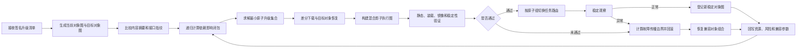
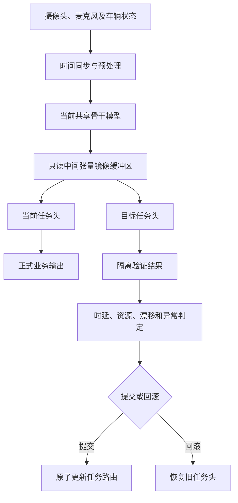
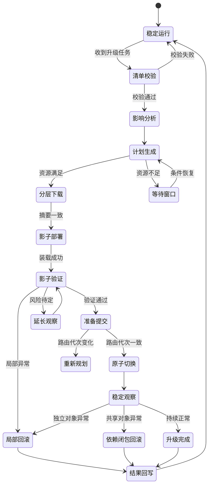

# 专利一：智能座舱端侧多任务模型分层升级方法（详细技术交底书）

> 文档状态：第一版详细稿  
> 申请类型：发明专利  
> 核心保护主线：接口指纹 -> 依赖影响闭包 -> 最小原子升级集合 -> 混合影子执行图 -> 任务级原子提交 -> 故障传播边界回滚 -> 参数回写闭环

## 1. 发明创造名称

**智能座舱端侧多任务模型分层升级方法**

名称共 18 个字，技术主题明确。后续可同步布局系统、电子设备和计算机可读存储介质权利要求。

## 2. 所属技术领域

本发明属于智能汽车智能座舱软件升级、车载人工智能模型部署及固件空中升级技术领域，具体涉及一种将智能座舱端侧多任务模型及其执行环境拆分为可独立管理的分层升级对象，依据接口指纹和依赖图确定满足兼容性约束的最小原子升级集合，并通过影子执行图、任务级热切换、故障传播边界回滚及升级结果反馈实现闭环升级的方法。

## 3. 现有技术

智能座舱域控制器通常部署驾驶员状态监测、乘员状态监测、语音识别、手势识别、视线追踪、舱内事件识别和多模态交互等端侧人工智能任务。为降低算力、内存和存储消耗，多个任务常共享同一基础骨干模型，并分别连接不同任务头、前后处理模块、量化参数、传感器标定参数和业务策略。

现有方案通常将模型文件、推理引擎或座舱应用视为整体升级包。即使采用字节级差分下载，也未识别多任务模型内部的共享骨干、任务头、量化尺度、算子集合、张量接口及运行时之间的依赖关系。版本号或文件摘要一致，仅能说明文件标识或内容未变，并不能证明输入输出张量、量化参数和执行接口相互兼容。

与本申请技术方向接近的现有技术包括多任务共享模型、车辆 OTA/FOTA、A/B 分区升级和应用热更新等方案。上述方案可分别解决模型推理、文件传输或整包恢复问题，但仍存在以下缺陷：

1. 无法准确判断一个任务头变化是否需要同步升级骨干模型、量化参数、推理运行时或传感器标定文件。
2. 以文件为粒度做差分，不能识别结构兼容性，也不能确定真正受影响的模型组件集合。
3. 单个非关键任务异常时，往往触发整个模型包或座舱应用回滚。
4. 多任务共享中间特征时，验证新任务头通常需要重复运行骨干模型，增加车端算力和温升。
5. 多个对象分步安装时，断电或进程重启可能形成模型、参数和运行时版本不一致。
6. 已验证对象与未验证对象缺少原子提交边界，容易形成未经验证的混合组合。
7. 升级失败原因未反馈至依赖关系和后续验证参数，相同硬件组合可能重复失败。

因此，需要一种以模型结构和执行接口为基础，而非仅以文件为基础的分层升级机制。

## 4. 目的

本发明旨在解决多任务模型升级粒度过粗、组件兼容关系不透明、影子验证资源开销高、局部故障引发整体回滚以及升级中断后状态不一致的问题。

本发明通过接口指纹把模型组件与实际推理接口绑定，通过依赖影响闭包确定受变化对象影响的范围，通过最小原子升级集合限制下载和部署对象，通过混合影子执行图复用未变化对象，通过任务路由原子提交避免中间态，通过故障传播边界实施局部回滚，并把升级结果反馈至后续依赖图和风险参数，形成完整技术闭环。

## 5. 技术方案及发明要点

### 5.1 术语与对象

**分层升级对象**是可被独立标识、校验、下载、部署、验证或回滚的模型相关实体，包括固件、推理运行时、骨干模型、任务头、前处理、后处理、量化参数、校准参数、词表、提示模板、传感器标定和业务策略中的至少一种。

**接口指纹**是依据升级对象的输入输出接口和执行环境生成的结构化摘要，不等同于用于校验文件完整性的内容摘要：

\[
F_i=H(S_i^{in},S_i^{out},D_i,Q_i,O_i,A_i,R_i)
\]

其中，\(S_i^{in}\) 和 \(S_i^{out}\) 分别表示输入输出数据类型及语义，\(D_i\) 表示张量维度和排列，\(Q_i\) 表示量化尺度及零点，\(O_i\) 表示算子集合，\(A_i\) 表示运行时接口版本，\(R_i\) 表示前后处理规则，\(H\) 表示摘要函数。

**原子一致性组**是必须同时部署、提交或回滚的一组对象。例如任务头及其专用量化参数属于同一原子一致性组。

**影响闭包**是从变化对象出发，沿硬依赖边、接口不兼容边和原子一致性关系递归扩展得到的对象集合。

**混合影子执行图**由影子槽中的目标对象和运行槽中未变化且兼容的当前对象共同组成，其输出不直接驱动正式座舱功能。

**故障传播边界**是根据异常对象、依赖关系、接口兼容性及原子一致性组计算得到的最小回滚范围。

### 5.2 关键数据结构

升级对象记录至少包括：

| 字段 | 技术含义 |
|---|---|
| object_id | 对象全局唯一标识 |
| layer_type | 固件、运行时、骨干、任务头或参数等层级 |
| current_version / target_version | 当前和目标版本 |
| content_hash | 文件内容完整性摘要 |
| interface_fingerprint | 结构和执行接口指纹 |
| dependency_expr | 依赖对象、版本范围和依赖类型 |
| conflict_expr | 不允许同时激活的对象或版本 |
| atomic_group_id | 原子一致性组标识 |
| resource_envelope | 存储、内存、算力、温度和耗时需求 |
| safety_level | 安全关键、功能关键或体验增强 |
| rollback_policy | 可否独立回滚、回滚目标及状态转换规则 |
| validation_profile | 指标、阈值、样本类型和观察周期 |

依赖边至少包括源对象、目标对象、硬依赖/软依赖/冲突/原子依赖类型、兼容版本范围和接口约束。升级事务记录至少包括事务标识、对象图快照、目标对象图、原子升级集合、当前状态、状态序号、校验摘要、恢复入口和异常原因。任务路由表至少包括任务标识、当前执行链、影子执行链、活动槽位及路由代次。

### 5.3 完整升级闭环

### 5.4 获取并校验升级清单

车端升级控制器接收目标升级清单，校验数字签名、发布时间、车型、硬件标识、最低可信版本和防回退计数器。校验通过后读取当前有效对象清单，分别形成当前对象图 \(G_c\) 和目标对象图 \(G_t\)。

若清单签名不通过、目标硬件不匹配或目标版本低于安全允许版本，则终止本次事务，并保持当前任务路由不变。

### 5.5 识别变化对象与计算影响闭包

同时比较对象的内容摘要和接口指纹。内容摘要不同表示对象内容变化；接口指纹不同表示结构或执行环境变化。任一变化均把对象加入初始集合 \(C_0\)。

影响闭包按下式迭代：

\[
C_{k+1}=C_k\cup H(C_k)\cup I(C_k)\cup A(C_k)
\]

其中，\(H(C_k)\) 为存在未满足硬依赖的对象，\(I(C_k)\) 为接口指纹不兼容的关联对象，\(A(C_k)\) 为同一原子一致性组对象。当 \(C_{k+1}=C_k\) 时停止，得到影响闭包。

该过程把“文件发生变化”转化为“执行链中哪些对象必须共同变化”，是本发明区别于普通差分升级的第一核心。

### 5.6 求解最小原子升级集合

从影响闭包中排除可继续复用且接口指纹兼容的当前对象，并补齐原子一致性组。对多个候选方案计算：

\[
J(P)=\alpha B(P)+\beta T(P)+\gamma R(P)+\delta U(P)
\]

其中，\(B(P)\) 为下载数据量，\(T(P)\) 为预计升级时长，\(R(P)\) 为升级失败风险，\(U(P)\) 为对在线任务的资源影响。仅在满足依赖完整性、接口兼容性、资源包络、安全等级和回滚能力约束的方案中选择代价最小者。

“最小”是满足上述约束后的综合代价最小，而非简单的文件数量最少。

### 5.7 分层顺序、差分恢复与完整性校验

对依赖图执行拓扑排序，并满足以下规则：

1. 被依赖对象先于依赖对象部署。
2. 同一原子一致性组内对象连续部署。
3. 安全关键任务晚于非安全任务执行路由切换。
4. 不可独立回滚对象仅在其依赖已验证后部署。
5. 高资源对象仅在满足资源包络时进入影子槽。

差分数据作用于只读基础副本，在暂存区恢复目标对象。恢复后重新计算内容摘要；摘要不一致、基础版本不匹配或差分恢复失败时，仅请求对应对象的完整包，不改变正式运行槽。

### 5.8 构建混合影子执行图

未变化且接口兼容的对象继续引用当前运行槽；待升级对象引用影子槽。若仅任务头变化，当前骨干模型产生的中间张量写入只读镜像缓冲区，并同时发送给当前任务头和目标任务头，以避免重复执行骨干模型。

若骨干模型变化，则在影子槽部署目标骨干和受影响任务头，并向当前执行图和影子执行图提供同源、时间对齐的传感器输入。影子对象不得修改正式执行链的张量、缓存和状态。

### 5.9 分级验证和风险判定

验证包括：

1. 静态验证：签名、摘要、接口指纹、依赖表达式和资源包络。
2. 装载验证：模型解析、算子注册、内存分配和设备映射。
3. 标准输入验证：输出形状、数值范围、异常码和确定性。
4. 镜像输入验证：真实传感器流或共享中间张量上的新旧输出差异。
5. 灰度路由验证：仅对非安全任务的受控请求启用目标链。
6. 稳定观察：持续检测时延、内存、温度、输出漂移和异常率。

任务风险可按下式计算：

\[
R_t=\sum_{m=1}^{n}w_mN(d_{t,m})+w_sS_t+w_fF_t
\]

其中，\(d_{t,m}\) 为第 \(m\) 项指标相对基准的偏差，\(S_t\) 为任务安全等级，\(F_t\) 为同一硬件/对象组合的历史失败系数。硬性指标超阈值时直接阻断，其他指标根据风险值确定通过、延长观察或回滚。

### 5.10 任务级原子提交

验证通过后冻结目标原子组配置并记录任务路由代次。通过比较交换操作把任务路由从当前执行链切换至目标执行链；只有提交时的路由代次与准备提交时一致，切换才生效。同一原子组内任一对象未准备完成，整个组不得提交。

旧对象在稳定观察期内保留为热备，避免新对象刚切换就失去快速回滚能力。

### 5.11 故障传播边界回滚

以异常对象为起点，将其及同一原子组对象加入回滚集合；检查依赖这些对象的已提交对象；若异常对象回滚后某对象仍满足版本和接口约束，则保留该对象，否则加入回滚集合；重复至集合不再变化。

由此仅回滚故障传播边界内对象，并保留边界外已验证且依然兼容的对象。若异常来自共享骨干、公共前处理或推理运行时，则回滚其依赖闭包；若异常仅来自接口兼容的独立任务头，则仅回滚该任务头及其专用参数。

### 5.12 断电恢复与事务一致性

每次状态迁移前写预备日志，完成操作后写完成日志。重新上电时读取最后一条校验有效的事务记录：

1. 下载或影子部署未完成：清理无效临时对象后继续。
2. 已准备提交但无提交完成记录：保持原路由。
3. 已切换但观察未结束：继续稳定观察。
4. 正在回滚：按对象图快照完成回滚。

### 5.13 结果反馈闭环

升级完成或回滚后记录对象组合、硬件环境、接口冲突、资源峰值、验证偏差、失败对象及回滚范围。对后续同类升级：

1. 提高历史失败组合的风险系数。
2. 修正资源预留和预计耗时。
3. 延长高风险任务的影子观察时间。
4. 把已确认的不兼容关系写回依赖图。
5. 对连续成功且稳定的非关键组合减少重复验证，但不取消安全硬门槛。

### 5.14 升级状态机

### 5.15 具体实施例

**实施例一：驾驶员监测任务头独立升级。** 当前模型包含共享视觉骨干、驾驶员监测任务头、乘员监测任务头和舱内事件任务头。目标清单仅改变驾驶员监测任务头及量化参数。二者属于同一原子组，接口指纹与当前骨干输出一致，因此最小升级集合不包含骨干和其他任务头。系统只下载两个目标对象，复用当前骨干的中间张量做影子验证，通过后仅切换驾驶员监测路由。稳定观察异常时只恢复旧驾驶员监测任务头。

**实施例二：共享骨干接口变化。** 目标骨干把输出通道数由 256 改为 384，接口指纹变化。依赖该输出的三个任务头被加入影响闭包。只有目标清单同时包含适配后的任务头，才能形成可提交原子组。任一安全任务验证失败，整个组不得提交。

**实施例三：运行时升级中断恢复。** 目标模型使用当前运行时不支持的新算子，运行时、目标模型和任务头被纳入影响闭包。下载完成后车辆断电，日志未出现影子部署完成记录。重新上电后保持当前路由，校验暂存对象后继续部署；摘要无效则只重下对应对象。

## 6. 有益效果

1. 接口指纹可发现版本号和文件摘要无法揭示的结构不兼容。
2. 影响闭包和原子一致性组可确定满足依赖约束的最小升级范围。
3. 共享中间张量可降低新任务头影子验证的算力和温升。
4. 路由代次及原子提交可避免并发切换形成不一致执行链。
5. 故障传播边界可实现局部回滚，并保留未受影响的升级成果。
6. 事务日志可保证断电、重启后的升级状态恢复。
7. 结果回写可使资源预留、兼容关系和验证强度适应具体车型。
8. 在降低流量和停机时间的同时提高座舱业务连续性。

## 7. 附图及其简要说明

1. 附图 1：完整升级闭环图，表示从对象图比较到反馈更新的控制链。
2. 附图 2：混合影子执行图，表示共享骨干中间张量如何同时验证新旧任务头。
3. 附图 3：升级状态机，表示等待、部署、验证、提交、观察及分层回滚状态。

上述附图均已使用 Mermaid 格式嵌入本文档，可在支持 Mermaid 的 Markdown 工具中直接渲染。

## 8. 权利要求

### 权利要求 1

一种智能座舱端侧多任务模型的分层升级方法，其特征在于，包括：

获取车端当前对象清单和目标升级清单，将智能座舱端侧多任务模型及其执行环境拆分为多个具有唯一对象标识的分层升级对象；

根据各分层升级对象的输入输出数据类型、张量维度、量化参数、算子集合、运行时接口及前后处理规则生成接口指纹，并根据分层升级对象之间的版本约束、接口约束和原子一致性关系建立依赖图；

根据所述当前对象清单和目标升级清单确定变化对象集合，从所述变化对象集合出发，沿所述依赖图中的硬依赖关系、接口指纹不兼容关系及原子一致性关系递归扩展，得到影响闭包；

从所述影响闭包中确定满足依赖完整性、接口兼容性、资源包络及回滚条件的最小原子升级集合，并生成分层升级计划；

根据所述分层升级计划将目标分层升级对象部署至影子槽，并使未变化且接口兼容的分层升级对象复用当前运行槽中的对象，形成影子执行图；

向所述影子执行图提供与当前执行图对应的镜像传感器数据或中间张量，对目标分层升级对象执行影子验证；

根据影子验证结果，以原子一致性组为单位修改任务路由，使验证通过的目标分层升级对象生效；以及

在目标分层升级对象发生异常时，根据异常对象的依赖关系、接口指纹和原子一致性关系确定故障传播边界，回滚所述故障传播边界内的对象，并保留所述故障传播边界外满足依赖约束的已生效对象。

### 权利要求 2

根据权利要求 1 所述的方法，其特征在于，所述分层升级对象包括固件对象、推理运行时对象、基础骨干模型对象、任务头对象、前处理对象、后处理对象、量化参数对象、传感器标定对象及业务策略对象中的至少三种。

### 权利要求 3

根据权利要求 1 所述的方法，其特征在于，所述接口指纹由输入输出数据类型及语义、张量维度及排列方式、量化尺度及零点、算子集合、运行时接口版本和前后处理规则中的至少四项生成。

### 权利要求 4

根据权利要求 1 所述的方法，其特征在于，所述依赖图至少包括硬依赖、软依赖、冲突关系和原子一致性关系，所述原子一致性关系用于限定多个对象同时提交或同时回滚。

### 权利要求 5

根据权利要求 1 所述的方法，其特征在于，所述递归扩展包括将与变化对象存在未满足版本约束的硬依赖对象、接口指纹不兼容的关联对象及同一原子一致性组对象加入影响闭包，直至影响闭包不再增加对象。

### 权利要求 6

根据权利要求 1 所述的方法，其特征在于，确定最小原子升级集合包括：根据下载数据量、预计升级时长、升级风险和在线任务资源影响计算候选方案代价，并选择满足资源包络和回滚条件的代价最小候选方案。

### 权利要求 7

根据权利要求 1 所述的方法，其特征在于，所述分层升级计划通过依赖图拓扑排序生成，并使被依赖对象先于依赖对象部署、同一原子一致性组对象连续部署及安全关键任务晚于非安全关键任务切换。

### 权利要求 8

根据权利要求 1 所述的方法，其特征在于，将目标对象对应的差分数据作用于基础对象副本以恢复目标对象，并仅在恢复对象的内容摘要与目标升级清单中的目标摘要一致时允许影子部署。

### 权利要求 9

根据权利要求 1 所述的方法，其特征在于，当变化对象为任务头对象且基础骨干模型对象未变化时，将当前骨干模型输出的中间张量写入只读镜像缓冲区，并分别提供给当前任务头和目标任务头。

### 权利要求 10

根据权利要求 1 所述的方法，其特征在于，所述影子验证包括静态兼容验证、模型装载验证、标准输入验证、镜像输入验证和稳定观察验证中的至少三种。

### 权利要求 11

根据权利要求 1 所述的方法，其特征在于，修改任务路由包括：在原子一致性组进入准备提交状态时记录任务路由代次，并通过比较交换操作切换任务路由；当提交时的路由代次不一致时停止切换并重新规划。

### 权利要求 12

根据权利要求 1 所述的方法，其特征在于，确定故障传播边界包括：将异常对象及同一原子一致性组对象加入回滚集合，并将回滚后不满足版本约束或接口指纹约束的已生效对象递归加入回滚集合。

### 权利要求 13

根据权利要求 1 所述的方法，其特征在于，在升级过程中记录具有状态序号和校验摘要的事务日志；车端重新上电后，根据最后一条校验有效的事务日志及任务路由状态继续影子部署、稳定观察或回滚，并在未记录提交完成时保持升级前任务路由。

## 申请策略与审查风险提示

正式提交前应重点检索“模型组件依赖图升级、共享中间张量影子验证、任务级模型路由切换、局部依赖闭包回滚”。说明书和独立权利要求应始终保留“接口指纹 -> 影响闭包 -> 混合影子执行图 -> 原子提交 -> 故障传播边界”这一连续数据与控制关系，避免被拆解为普通依赖图、双槽和回滚的简单并列。

内容摘要用于验证文件完整性，接口指纹用于判断执行结构兼容性，二者不可混写。固定七层、具体阈值和单一公式不宜全部写入独立权利要求，以避免不必要限缩。本稿属于技术交底和权利要求建议稿，正式申请前仍应由执业专利代理师结合检索结果做新颖性、创造性和支持性复核。
