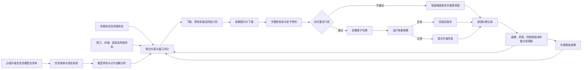
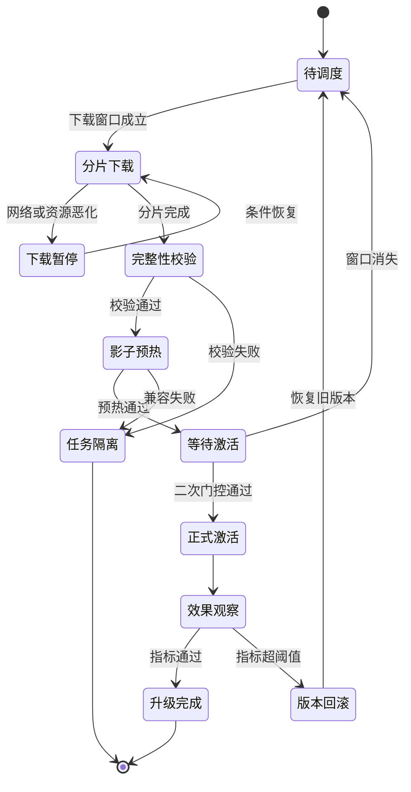
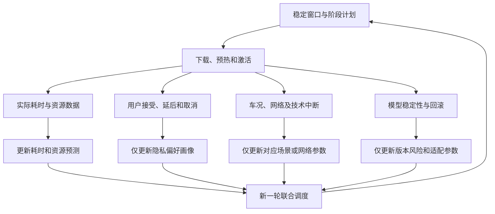

# 专利三：座舱模型画像感知式 FOTA 升级调度方法（详细技术交底书）

> 文档状态：第一版详细稿  
> 申请类型：发明专利  
> 核心保护主线：车端隐私画像 -> 未来稳定窗口预测 -> 分阶段硬约束与软评分 -> 依赖图分片下载 -> 影子预热 -> 实时二次激活门控 -> 动态重调度/回滚 -> 按原因隔离的参数反馈

## 1. 发明创造名称

**座舱模型画像感知式升级调度方法**

名称共 16 个字。标题不把保护范围限定于某一模型类型；说明书中明确其适用于 FOTA/OTA 模型升级。

## 2. 所属技术领域

本发明属于车联网、车辆远程升级和智能座舱端侧人工智能模型管理技术领域，具体涉及一种在不上传用户原始行为数据的条件下，根据隐私化用户画像、车辆运行状态、座舱计算资源、网络条件、场景状态及模型风险等级，联合确定模型包分片下载、模型预热、版本激活和异常回退时机，并根据执行效果自适应更新调度参数的方法。

## 3. 现有技术

智能座舱中的语音识别、语义理解、驾驶员监测、乘员识别、手势识别、个性化推荐和多模态交互通常由车端模型实现。随着模型、词表、量化参数、运行时算子及配置持续更新，需要通过 FOTA/OTA 对上述对象升级。

现有方案通常采用固定预约、检测停车后立即升级、充电或 Wi-Fi 条件触发、同批车辆统一下发等方式。其不足包括：

1. 固定预约不能保证届时车辆仍停车、供电充足、网络稳定和算力空闲。
2. 下载、解密、校验、编译、加载和激活被视为连续过程，未按阶段风险和资源需求分别调度。
3. 仅判断当前是否停车，不能预测该状态能否持续覆盖升级所需时间，容易把接人、服务区短停等场景误判为完整窗口。
4. 驾驶员监测与娱乐推荐模型风险不同，采用同一阈值会带来安全风险或不必要打扰。
5. 历史中断、实际速率、预热耗时、用户延后和激活后资源变化未用于修正后续计划。
6. 使用位置轨迹或原始行为做个性化调度可能造成过度采集。
7. 技术失败、网络失败和用户主动拒绝混在同一反馈标签中，会污染画像和调度模型。

本发明与普通个性化推荐不同：输出不是内容排序，而是直接约束车端下载、预热、模型路由切换和回滚的执行状态。本发明也不同于普通预约升级：其预测未来稳定窗口，并分别调度三个阶段，执行期间持续重估，结果按原因回写。

## 4. 目的

本发明旨在实现：

1. 在车端生成不含原始轨迹、音视频及生物特征的隐私画像。
2. 联合模型风险、车况、资源、网络和场景执行硬约束筛选。
3. 对可执行候选窗口计算完成概率和综合收益。
4. 将升级拆为分片下载、影子预热和正式激活三个独立阶段。
5. 按分片依赖关系和预热关键路径利用短时间窗口。
6. 在激活前用实时状态执行二次门控并通过双槽原子切换。
7. 条件变化时限速、暂停、保存检查点、取消激活、重调度或回滚。
8. 将用户响应、车况中断、网络异常、资源异常及模型故障分别反馈至不同参数，形成稳定闭环。

## 5. 技术方案及发明要点

### 5.1 总体架构

系统包括升级任务接收模块、模型风险与依赖分析模块、隐私画像模块、车况与场景感知模块、资源预测模块、联合约束模块、候选窗口生成模块、分片调度模块、模型预热模块、激活控制模块、异常恢复模块和闭环学习模块。

### 5.2 升级任务结构

| 字段 | 技术含义 |
|---|---|
| task_id / model_id | 任务及模型唯一标识 |
| current_version / target_version | 当前和目标版本 |
| risk_level | 安全相关、重要交互或一般体验 |
| chunk_manifest | 分片编号、大小、摘要和来源 |
| dependency_graph | 模型、运行时、算子、词表和配置依赖 |
| stage_resource | 下载、预热、激活阶段资源预算 |
| minimum_window | 各阶段最短连续执行时间 |
| deadline | 期望完成时间 |
| rollback_version | 可恢复的已验证版本 |
| activation_gate | 激活所需车况和资源条件 |
| validation_profile | 完整性、兼容性和试推理规则 |

升级任务拆为下载、预热和激活三个子任务，分别具有状态、资源预算、执行窗口和恢复点。

### 5.3 车端隐私画像

画像不保存或上传原始位置轨迹、原始车内音视频、人脸或声纹、完整账号标识、精确行程起止点及可还原活动规律的原始事件序列。

画像标识由车辆随机盐值和车端账号标识生成不可逆摘要，盐值留在安全区域。画像字段包括时段出行概率、停车时长分位数、升级接受率、主动延后率、分阶段历史中断率、静默下载偏好、提醒偏好、场景类型、网络偏好、画像置信度和更新时间。

带时间衰减的统计：

\[
u_i^{(n)}=
\frac{\sum_{j=1}^{n}\rho^{n-j}v_{i,j}}
{\sum_{j=1}^{n}\rho^{n-j}}
\]

随后执行裁剪和分桶：

\[
\bar u_i=Q_i\left(\min(u_i^{max},\max(u_i^{min},u_i^{(n)}))\right)
\]

当用户关闭个性化、删除账号或重置车辆时清除画像，切换为车型默认策略。画像置信度不足时采用更保守的默认稳定窗口，不允许低置信度画像直接驱动正式激活。

### 5.4 联合状态与硬约束

构建状态向量：

\[
X_t=[U_t,V_t,R_t,C_t,N_t,M_t]
\]

其中，\(U_t\) 为隐私画像，\(V_t\) 为车速、挡位、点火、车门、充电和电源状态，\(R_t\) 为 CPU/GPU/NPU、内存和存储，\(C_t\) 为住宅停车、办公停车、充电或临停场景，\(N_t\) 为带宽、时延、丢包和计费类型，\(M_t\) 为模型大小、风险和截止时间。

对候选窗口 \(W=[t_s,t_e]\) 和阶段 \(p\)：

\[
H(W,p)=\prod_{q=1}^{Q}I(g_q(W,p)\le 0)
\]

任一必要约束不满足时，\(H=0\)，对应阶段不得执行。硬约束至少包括：

\[
E_{available}-E_{safe}\ge E_{stage}
\]

\[
S_{free}\ge S_{package}+S_{staging}+S_{rollback}
\]

\[
\widehat T_{chip}(W)\le T_{limit}-\Delta T
\]

\[
P(T_{stable}\ge D_p\mid X_t)\ge\theta_{r,p}
\]

下载可在行驶时受限进行，但不得抢占导航和安全提醒带宽；预热要求计算资源低于阈值；激活要求车辆处于允许状态并保有完整旧版本。

### 5.5 稳定窗口预测与软评分

稳定窗口预测不是判断“当前停车”，而是预测状态持续时间。输入包括当前停车时长、时间分桶、场景类型、充电状态、车门及座椅变化、历史停车时长分布、离散化导航停留类型、远程空调/预约充电任务及同类场景中断历史。

\[
P_{finish}=P(T_{stable}\ge \widehat D_p+\Delta D_r\mid X_t)
\]

对硬约束通过的窗口计算：

\[
J(W,p)=w_1P_{finish}+w_2Q_{resource}+w_3Q_{scene}
+w_4Q_{preference}+w_5Q_{urgency}
-w_6R_{interrupt}-w_7C_{network}
\]

\[
S(W,p)=H(W,p)\cdot J(W,p)
\]

系统为下载、预热、激活分别选择超过阶段阈值且资源互不冲突的窗口。安全相关模型采用更高完成概率、更长时间裕量和更严格激活条件。

### 5.6 依赖图驱动的分片下载

升级包分片形成有向无环图 \(G=(V,E)\)。节点为权重块、词表、量化表、运行时算子、配置或校准参数，边表示先后依赖。

\[
\Pi_i=aC_i+bR_i+cA_i+dU_i-eL_i
\]

其中，\(C_i\) 为关键路径贡献，\(R_i\) 为缓存复用率，\(A_i\) 为启动预热的必要程度，\(U_i\) 为紧迫度，\(L_i\) 为下载耗时。系统优先下载位于关键路径且可提前启动预热的分片，而非按文件物理顺序。

每个分片独立记录字节范围、摘要、网络类型、完成时间和重试次数。中断后只重新下载未完成或校验失败分片；全部完成后执行包签名、依赖和车型适配校验。

### 5.7 影子预热

候选模型不替换当前业务输出，预热包括：

1. 解密和解压。
2. 数字签名及完整性验证。
3. 模型格式和运行时兼容校验。
4. 算子编译及硬件缓存生成。
5. 权重映射和内存预分配。
6. 使用脱敏样本或特征摘要试推理。
7. 记录时延、峰值内存、处理器占用和温升。
8. 生成通过、限制激活或禁止激活报告。

限制激活表示只允许低比例灰度，不得直接全面切换。

### 5.8 实时二次激活门控

候选窗口生成后，车况可能变化，因此激活前重新检查：

1. 车辆运行状态。
2. 高优先级任务冲突。
3. 电量、电压和温度。
4. 新模型及依赖完整性。
5. 旧版本和回滚数据可用性。
6. 当前交互是否可安全中断。
7. 风险等级对应的用户确认。
8. 预热结果和资源余量。

门控通过后原子更新运行槽/候选槽版本指针；未通过则保留已预热候选版本，重新生成激活窗口。

### 5.9 自适应执行与异常分支

周期性估算：

\[
\widehat D_{remain}=
\frac{B_{remain}}{\widehat R_{network}}
+\widehat D_{verify}+\widehat D_{preheat}+\widehat D_{activate}
\]

\[
\widehat R_t=\lambda R_t+(1-\lambda)\widehat R_{t-1}
\]

若：

\[
\widehat T_{stable}<\widehat D_{remain}+\Delta D_r
\]

则按阶段执行限速、暂停、保存校验结果、保存预热检查点、取消激活或回滚，而不是机械完成原计划。

主要异常分支：

1. 用户返回或车辆准备起步：下载可限额继续，预热暂停，未开始激活取消。
2. 电量或电压不足：暂停高负载处理，保留分片和检查点，重排至充电窗口。
3. 温度或资源突升：降低并发、释放候选内存，为安全业务保留资源。
4. 网络异常：写入断点，按网络偏好暂停或限速，不废弃完整包。
5. 签名或兼容失败：隔离失败对象，请求兼容版本，不更新用户画像。
6. 激活后异常：切回旧模型，停止候选进程，更新版本风险而非用户偏好。
7. 多任务冲突：按风险、截止时间、依赖和资源释放收益排序；运行时冲突时禁止同时预热或激活。

### 5.10 按原因隔离的反馈闭环

反馈记录包括计划窗口、实际窗口、阶段结果、中断原因、耗时误差、用户响应、资源偏差、模型运行指标和回滚结果。

\[
e_D=\frac{D_{actual}-D_{predicted}}{\max(D_{predicted},\varepsilon)}
\]

\[
\theta_{n+1}=(1-\eta c_n)\theta_n+\eta c_ny_n
\]

其中，\(c_n\) 为反馈可信度。不同原因只更新对应参数：

1. 用户主动延后：更新提醒偏好和打扰风险。
2. 车辆起步中断：更新场景稳定度。
3. 网络异常：更新网络完成概率。
4. 资源超限：更新阶段资源需求。
5. 模型校验失败：更新版本适配风险，不更新用户画像。
6. 激活后回滚：更新版本风险和车型适配。

这种“原因隔离”防止技术故障污染用户偏好，是本申请闭环稳定性的关键创新点。

### 5.11 与普通预约升级的实质区别

| 对比项 | 普通预约升级 | 本发明 |
|---|---|---|
| 时间判断 | 到达固定时刻 | 预测未来状态能否持续 |
| 执行粒度 | 下载、安装和激活连续执行 | 下载、预热、激活分别调度 |
| 约束 | 当前停车、电量等单项条件 | 风险分级硬约束与软评分 |
| 下载 | 整包或物理顺序 | 依赖图关键路径分片 |
| 模型准备 | 下载后安装 | 影子编译、加载和试推理 |
| 激活 | 到时执行 | 使用实时状态二次门控 |
| 中断处理 | 延后或失败 | 限速、检查点、重调度或回滚 |
| 用户数据 | 可能上传原始行为 | 车端不可逆分桶画像 |
| 反馈 | 成功/失败标签 | 按原因分别更新不同参数 |
| 技术闭环 | 无 | 预测、执行、验证、分类反馈、修正 |

### 5.12 具体实施例

**实施例一：住宅充电场景。** 语音模型包 1.2GB、20 个分片，风险为重要交互。车辆 21:40 在住宅充电，画像表明再次出行概率低，稳定窗口预测 9.1 小时，完成概率 97%。系统先下载模型结构、词表和关键权重，完成影子编译和试推理，凌晨再次门控后原子切换。实际下载比预计短 3 分钟，仅更新该场景该网络类型的带宽估计。

**实施例二：服务区短停。** 娱乐模型包 800MB，预计停车 7-12 分钟。下载需 6 分钟，预热和激活需 15 分钟。系统只执行关键分片下载并保存断点，不预热、不激活；到达住宅后再生成后两阶段窗口。

**实施例三：预热时远程空调唤醒。** 驾驶员监测模型预热期间远程空调使处理器和温度升高。系统保存签名校验、算子编译和权重映射检查点，释放候选内存，优先保障车辆控制；温度恢复后续接预热，激活前重新检查车速、挡位、电量和回滚能力。

**实施例四：反馈标签隔离。** 用户主动延后只更新提醒偏好；网络断开只更新网络完成概率；签名失败只更新版本风险。三类事件互不污染，使后续窗口预测和用户偏好保持可解释。

## 6. 有益效果

1. 避免把短暂停车错误识别为完整升级窗口。
2. 可在不同场景分别完成下载、预热和激活。
3. 优先下载预热关键路径分片，提高短窗口利用率。
4. 在不切换业务输出时提前完成编译、加载和试推理。
5. 通过实时二次门控、双槽切换和回滚降低激活风险。
6. 避免预热与导航、语音报警和驾驶员监测争抢资源。
7. 状态变化时保存进度并动态重调度。
8. 通过原因分类避免技术失败污染用户画像。
9. 无需上传原始行为和位置轨迹即可实现个性化调度。
10. 通过预测误差反馈持续提高完成概率和资源估算精度。

## 7. 附图及其简要说明

1. 附图 1：总体系统架构图，表示任务、画像、车况资源、阶段执行和反馈之间的关系。
2. 附图 2：升级状态图，表示下载暂停、预热、等待激活、观察及回滚状态。
3. 附图 3：按原因隔离的反馈闭环图，表示不同事件分别更新不同参数。

上述附图均已用 Mermaid 格式嵌入本文档。

## 8. 权利要求

### 权利要求 1

一种座舱模型的画像感知式升级调度方法，其特征在于，包括：

获取智能座舱模型升级任务，解析所述升级任务中的模型分片、分片依赖关系、阶段资源需求、升级对象风险等级、激活条件及回滚信息；

在车辆本地根据用户升级响应事件、出行时段分桶、停车时长分布及升级中断事件生成隐私画像，所述隐私画像不包含用户原始位置轨迹、原始音视频数据及可直接识别用户身份的账号信息；

采集车辆运行状态、座舱计算资源状态、网络状态和环境场景状态，并基于所述隐私画像及所采集的状态预测至少一个车辆状态稳定窗口；

分别针对模型分片下载阶段、模型预热阶段和模型激活阶段建立与升级对象风险等级对应的硬约束，在候选时间窗口满足对应阶段全部硬约束时，计算候选时间窗口的阶段完成概率、资源充裕度、场景稳定度、用户偏好匹配度、升级紧迫度及中断风险，生成各阶段执行窗口；

按照分片依赖关系确定模型分片下载顺序，在下载阶段执行可断点续传的分片下载，并在模型预热阶段于不替换当前业务模型输出的影子环境中完成模型完整性校验、运行时兼容校验、模型加载及试推理；

在模型激活阶段开始前，根据实时车辆运行状态和实时座舱计算资源状态再次执行激活门控，并在激活门控通过时，通过运行槽和候选槽之间的版本指针切换激活目标模型；

在任一阶段检测到车辆运行状态、座舱计算资源状态、网络状态或环境场景状态不再满足对应硬约束时，保存当前阶段的可恢复执行信息，并执行限速、暂停、取消激活、重新生成执行窗口或回滚中的至少一种操作；以及

获取各阶段实际耗时、资源消耗、中断原因、用户响应及模型激活后的运行指标，根据中断原因分别更新隐私画像、稳定窗口预测参数、资源需求参数或目标模型版本风险参数，以用于后续升级任务调度。

### 权利要求 2

根据权利要求 1 所述的方法，其特征在于，隐私画像通过车辆随机盐值和车端用户标识生成的不可逆画像标识关联；用户升级响应、出行时段及停车时长经时间衰减、区间裁剪和分桶后写入隐私画像。

### 权利要求 3

根据权利要求 1 所述的方法，其特征在于，隐私画像至少包括时段出行概率、停车时长分位数、升级接受率、主动延后率、历史中断率、静默下载偏好、提醒偏好、网络偏好和画像置信度；画像置信度低于阈值时采用车型默认参数。

### 权利要求 4

根据权利要求 1 所述的方法，其特征在于，硬约束至少包括车辆运行状态、电量或电压、存储空间、芯片温度、计算资源、网络、稳定窗口持续时间、模型依赖及旧版本可回滚约束；任一必要约束不满足时禁止对应阶段执行。

### 权利要求 5

根据权利要求 1 所述的方法，其特征在于，执行窗口通过对阶段完成概率、资源充裕度、场景稳定度、用户偏好匹配度和升级紧迫度加权，并扣除中断风险和网络成本而生成，权重和阶段阈值根据升级对象风险等级设置。

### 权利要求 6

根据权利要求 1 所述的方法，其特征在于，车辆状态稳定窗口根据当前停车持续时间、时间分桶、场景类型、充电状态、车门状态、座椅占用、历史停车时长分布及车辆任务状态中的至少两项预测，并输出预计持续时间及完成概率。

### 权利要求 7

根据权利要求 1 所述的方法，其特征在于，模型分片构成有向无环依赖图，并根据分片的依赖关键路径贡献度、本地缓存复用率、对预热的必要程度、升级紧迫度及预计下载耗时确定优先级。

### 权利要求 8

根据权利要求 1 所述的方法，其特征在于，每一模型分片具有独立摘要值和断点记录；网络中断后仅下载未完成或摘要失败分片，全部分片完成后执行包级数字签名和版本依赖校验。

### 权利要求 9

根据权利要求 1 所述的方法，其特征在于，模型预热包括解密、解压、模型格式校验、运行时兼容校验、硬件算子编译、权重映射、内存预分配及使用脱敏样本或特征摘要试推理中的至少四项，且预热输出不驱动座舱业务。

### 权利要求 10

根据权利要求 1 所述的方法，其特征在于，激活门控包括对车辆状态、模型依赖完整性、候选模型预热结果、旧版本回滚能力、芯片温度、可用内存、高优先级车辆任务及用户确认状态进行实时检查；未通过时保留已预热候选模型并重新生成激活窗口。

### 权利要求 11

根据权利要求 1 所述的方法，其特征在于，根据剩余分片大小、实时网络速度、剩余校验耗时、预热耗时及激活耗时更新剩余执行时间；当预测稳定窗口小于剩余执行时间与风险安全裕量之和时，对当前阶段执行降低并发、限速、暂停、保存检查点或取消激活中的至少一种。

### 权利要求 12

根据权利要求 1 所述的方法，其特征在于，当检测到车门打开、驾驶座占用、制动踏板触发、挡位变化或车辆唤醒事件时，暂停模型预热或取消尚未开始的激活；允许满足业务带宽配额的分片下载继续，并将相应事件记录为场景稳定性中断原因。

### 权利要求 13

根据权利要求 1 所述的方法，其特征在于，模型激活后在观察周期内采集推理时延、异常输出比例、进程重启次数、内存占用及芯片温升；指标超过风险等级阈值时切回旧版本，并将目标版本标记为禁止或限制激活；其中用户主动延后、车辆状态中断、网络异常、资源异常及模型校验失败分别更新不同调度参数。

## 申请策略与审查风险提示

本申请的核心不是“根据用户习惯选择时间”，而是画像和车况共同预测未来稳定窗口，稳定窗口分别约束下载、预热、激活三个物理执行阶段，执行状态变化触发检查点或回滚，最终按中断原因隔离更新调度参数。

正式提交前应重点检索 AI 预测 OTA 时机、个性化升级、分片依赖下载、模型预热及激活门控。独立权利要求应保留“阶段分离、未来窗口、实时二次门控、原因隔离反馈”四个核心关系，防止被评价为普通预约升级或推荐算法。本稿属于技术交底和权利要求建议稿，正式提交前仍应由执业代理师结合检索结果复核。
