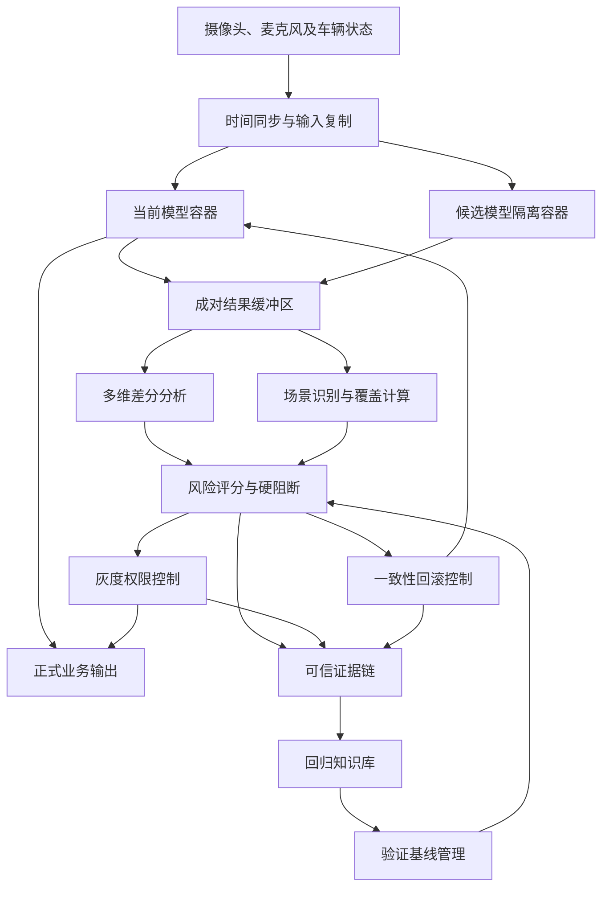
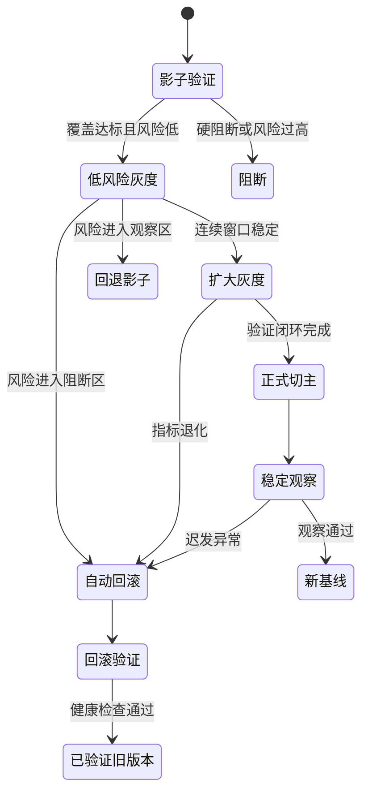
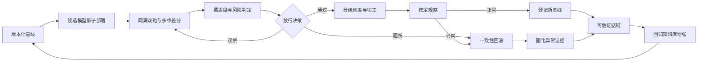

# 专利二：智能座舱 AI 模型车端回归验证与自动回滚方法（详细技术交底书）

> 文档状态：第一版详细稿  
> 申请类型：发明专利  
> 核心保护主线：版本化验证基线 -> 同源影子双跑 -> 多维差分 -> 关键场景不可补偿覆盖 -> 动态风险与硬阻断 -> 分级灰度 -> 一致性回滚 -> 可信证据链与基线增强

## 1. 发明创造名称

**智能座舱模型车端验证与自动回滚方法**

名称共 19 个字，能够覆盖视觉、语音及多模态模型。后续可同步布局系统、电子设备和存储介质权利要求。

## 2. 所属技术领域

本发明属于智能座舱端侧人工智能模型质量保障、车辆软件升级控制及功能安全技术领域，具体涉及一种在智能座舱人工智能模型升级过程中，基于版本化验证基线、影子推理、多维差分、场景覆盖度、动态风险评分、分级灰度、原子回滚及可信证据链，实现候选模型从部署、验证、启用到异常恢复全过程闭环控制的方法。

## 3. 现有技术

现有智能座舱模型升级通常以升级包下载成功、文件校验通过、模型进程能够启动和业务进程未崩溃作为成功条件。该方式只能证明候选模型具备基本可运行性，不能证明其在真实车辆环境中保持原有功能质量。

驾驶员监测、乘员检测、语音唤醒、视线估计和多模态交互模型具有输入分布复杂、输出概率化、退化不一定引发软件故障、部分错误仅在特定场景出现等特点。候选模型即使不崩溃，仍可能发生安全事件漏检、误唤醒增加、置信度失真、时序抖动、推理超时、中间表征漂移或资源竞争加剧。

现有方案至少存在以下不足：

1. 验证基准与车型、硬件、模型版本、运行参数和场景条件缺少绑定。
2. 只比较最终标签，无法识别置信度、输出分布、中间特征和时间稳定性方面的隐性退化。
3. 只统计总样本量，大量普通样本可能掩盖高风险场景未覆盖。
4. 各指标独立判断，缺少结合危害严重度、统计不确定性和异常持续性的风险判定。
5. 灰度通常按车辆比例执行，不能在单车内部按任务、场景和交互次数限制控制权。
6. 回滚只恢复模型文件，不能保证模型路由、运行配置、缓存状态和共享依赖一致。
7. 验证结果、放行依据和回滚动作缺少可信关联，难以审计和复现。
8. 回滚原因未反馈至后续验证基线，不能形成持续增强闭环。

## 4. 目的

本发明旨在使候选模型在获得正式业务控制权前，经过具有关键场景覆盖约束的影子验证和风险判定；在有限启用期间持续监测；在出现不可接受风险时完成具有状态一致性的自动回滚；并将全过程形成可信证据链，把异常场景反馈至后续验证基线。

具体解决：

1. 原始敏感数据不出车条件下的真实环境验证问题。
2. 普通输出差异与技术退化的区分问题。
3. 高风险场景覆盖被总样本平均掩盖的问题。
4. 模型退化、危害等级、覆盖不足和持续异常统一决策的问题。
5. 回滚时模型、配置、路由和状态一致性问题。
6. 升级验证全过程可追溯和后续基线自增强问题。

## 5. 技术方案及发明要点

### 5.1 术语定义

当前模型是升级前提供正式业务输出的模型；候选模型是已部署但尚未完全取得业务控制权的新模型；影子推理是候选模型接收与当前模型时间对齐的输入，但输出保持隔离；验证基线是与模型、硬件、参数和场景绑定的质量契约；场景单元是按任务、环境、人员、车辆、资源和故障状态划分的最小验证场景；硬阻断条件是不得由其他良好指标抵消的安全约束；原子回滚是把模型路由、配置、状态和依赖作为一致性事务恢复；证据链是顺序关联并受完整性保护的验证与决策记录集合。

### 5.2 系统架构

### 5.3 版本化验证基线

针对任务 \(k\) 建立：

\[
B_k=\{V_k,H_k,P_k,G_k,M_k,T_k,W_k,S_k\}
\]

其中，\(V_k\) 为模型及依赖版本，\(H_k\) 为硬件、驱动和推理框架，\(P_k\) 为预处理、后处理及运行参数，\(G_k\) 为场景单元集合，\(M_k\) 为验证指标集合，\(T_k\) 为接受阈值与硬阻断阈值，\(W_k\) 为场景和指标权重，\(S_k\) 为任务风险等级。

场景单元可表示为：

\[
g_j=(任务,光照,噪声,人员属性,姿态,车辆状态,资源状态,故障状态)
\]

例如，驾驶员疲劳检测包括夜间、逆光、佩戴眼镜、面部遮挡、偏头、道路颠簸和处理器高负载等组合场景。基线包含性能边界、安全边界和运行边界，并经数字签名与升级清单绑定，防止通过擅自降低阈值放行候选模型。

### 5.4 同源影子推理

输入复制模块把具有统一时间戳和序列号的传感器数据分别送入当前模型和候选模型。当前模型继续驱动业务；候选输出进入隔离通道。

为保证可比性：

1. 两模型使用同一帧或同一音频时间窗。
2. 使用有版本记录的等价预处理。
3. 时序模型建立可比较的初始状态。
4. 同时记录输入质量、丢帧、时钟偏差和资源抢占。
5. 成对结果关联至同一场景单元。
6. 原始图像和音频仅在车端易失缓冲区处理，持久化时保存不可逆特征、统计量或摘要。

输入时间偏差超过阈值的样本不参与性能差分，但计入数据质量异常。

### 5.5 多维差分判定

对数值越小越优的指标：

\[
d_i=\frac{m_i^{new}-m_i^{base}}{\max(|m_i^{base}|,\varepsilon)}
\]

对数值越大越优的指标：

\[
d_i=\frac{m_i^{base}-m_i^{new}}{\max(|m_i^{base}|,\varepsilon)}
\]

去除允许波动后的有效退化量：

\[
d_i^+=\max(0,d_i-\tau_i)
\]

综合差分：

\[
D=\frac{\sum_i w_i\cdot clip(d_i^+/s_i,0,d_{max})}{\sum_iw_i}
\]

差分指标至少选取以下三项：

1. 标签、意图、事件或控制语义差分。
2. 高风险事件漏检差分。
3. 置信度差分。
4. 输出概率分布的杰森-香农散度。
5. 中间特征均值、协方差、最大均值差异或表征相似度。
6. 连续帧抖动和状态切换频率。
7. 平均、P95/P99 时延及截止时间超限率。
8. CPU、NPU、内存、功耗和温度差分。
9. 模型、配置、依赖及运行参数完整性差分。

对低概率安全事件，使用统计置信上界判定，避免样本不足导致虚假通过。设观测错误率为 \(\hat p\)、样本数为 \(n\)，可采用威尔逊上置信界：

\[
p_U=
\frac{\hat p+\frac{z^2}{2n}+z\sqrt{\frac{\hat p(1-\hat p)}{n}+\frac{z^2}{4n^2}}}
{1+\frac{z^2}{n}}
\]

仅当 \(p_U\) 不超过基线安全边界时，允许进入下一阶段。

### 5.6 场景覆盖度与不可补偿约束

设基线包含 \(N\) 个场景单元，权重为 \(q_j\)。当场景有效样本量、数据质量和统计置信度均达标时，\(I_j=1\)，否则为 0：

\[
C=\frac{\sum_{j=1}^{N}q_jI_j}{\sum_{j=1}^{N}q_j}
\]

关键场景约束为：

\[
C_{critical}=\min_{j\in G_{critical}}I_j
\]

任一关键场景不达标即 \(C_{critical}=0\)，不得用普通场景高覆盖抵消。考虑未知场景比例 \(O\) 后：

\[
C_{eff}=C(1-O)
\]

未知场景比例持续升高时，候选模型保持影子状态并触发补充验证。

### 5.7 动态风险与硬阻断

风险输入包括综合差分 \(D\)、覆盖不足 \(1-C_{eff}\)、危害严重度 \(S\)、统计不确定度 \(U\)、异常持续性 \(P\) 和完整性异常 \(I\)：

\[
R=100\cdot\frac{1}{1+\exp[-(\beta_0+\beta_DD+\beta_C(1-C_{eff})+\beta_SS+\beta_UU+\beta_PP+\beta_II)]}
\]

同时设置：

\[
H=H_{安全边界}\lor H_{关键覆盖}\lor H_{完整性}\lor H_{截止时间}\lor H_{运行异常}
\]

只要 \(H=1\) 就禁止切主。多任务整包风险取关键任务最大值与全任务加权值中的较大者，避免关键任务被平均。

阈值示例仅用于说明，不构成限定：

| 指标 | 通过 | 观察 | 阻断 |
|---|---:|---:|---:|
| 关键场景覆盖 | 100% | 不适用 | 小于 100% |
| 总体有效覆盖 | 不低于 95% | 85%-95% | 低于 85% |
| 任务风险评分 | 小于 40 | 40-70 | 不低于 70 |
| 安全事件漏检率增量 | 不超过 0.2% | 0.2%-0.5% | 超过 0.5% |
| P99 时延增量 | 不超过 10% | 10%-20% | 超过 20% |
| 连续截止超限 | 不超过 1 次 | 2 次 | 3 次及以上 |
| 完整性异常 | 无 | 无 | 任意一次 |

### 5.8 分级灰度控制

候选模型逐级取得权限：

1. 纯影子，不产生正式输出。
2. 仅供内部记录或非安全提示使用。
3. 在低风险场景按少量交互次数启用。
4. 连续窗口稳定后扩大任务或场景范围。
5. 成为当前模型，旧模型继续热备。
6. 稳定观察通过后登记为新基线。

灰度可按任务、场景、时间、交互次数或用户会话限定，而非仅按车辆数量。每个观察窗口结束后重新计算覆盖和风险。

### 5.9 一致性自动回滚

触发条件包括硬阻断、风险达到阻断阈值、观察区风险持续上升、候选进程崩溃、截止时间连续超限、关键任务连续异常或完整性校验失败。

回滚作为事务执行：

1. 冻结候选模型新请求。
2. 完成、丢弃或迁移正在处理的请求。
3. 保存兼容状态并隔离候选私有状态。
4. 校验旧模型、配置、依赖和状态转换规则。
5. 原子切换模型路由指针至已验证分区。
6. 恢复兼容状态；不兼容时使用安全默认状态。
7. 执行启动、自检、时延和关键功能健康检查。
8. 健康检查失败则进入最小风险功能模式并上报。

多任务共享骨干时，根据依赖图确定粒度：独立任务头且接口兼容时局部回滚；异常涉及共享骨干、公共预处理或共享状态时回滚依赖闭包。

### 5.10 可信证据链与基线增强

每个事件记录：

\[
E_i=\{序号,时间戳,单调计数器,车辆匿名标识,升级清单摘要,基线摘要,模型摘要,场景摘要,指标摘要,覆盖度,风险评分,决策,执行结果,前序摘要\}
\]

\[
h_i=Hash(h_{i-1}\|E_i)
\]

车端可信模块对摘要签名，使记录删除、修改或调序均可被发现。证据链覆盖包校验、基线选择、影子窗口、差分指标、覆盖不足、风险判定、权限变化、切主、回滚和健康检查。

阻断或回滚后，把异常场景、指标、持续时间和依赖关系写入回归知识库。后续同模型族升级自动提高对应场景权重、最低样本量或阈值严格度。

### 5.11 具体实施例

**实施例一：驾驶员疲劳检测阻断。** 当前模型 3.8，候选模型 3.9。总体有效覆盖 96%，但“夜间+眼镜+偏头”未达到最低样本量，关键场景覆盖为 0；候选总体准确率提升 1.4%，该关键场景漏检率却由 1.2% 升至 1.7%。系统不允许总体准确率抵消关键覆盖和安全边界，保持旧模型，并把异常场景写入后续强制基线。

**实施例二：语音模型逐级灰度。** 候选模型影子阶段一致率 98.7%，误唤醒增加 0.03%，P99 时延增加 6%，风险 32。系统从 1% 非关键交互灰度扩大至 20%；高速风噪场景出现分布漂移，风险升至 52，灰度自动退回 5%。补充覆盖后连续五个窗口风险低于 35，才继续扩大并切主。

**实施例三：任务头局部回滚。** 共享视觉骨干连接驾驶员状态与乘员手势任务头，仅手势头升级。灰度期间手势输出抖动，风险 75；依赖图确认骨干和驾驶员任务未受影响，系统仅切回旧手势头。若量化尺度或骨干版本变化，则回滚整个依赖闭包。

## 6. 有益效果

1. 从“可运行检查”提升为真实场景下的功能质量验证。
2. 同源输入双跑提高新旧模型比较的有效性。
3. 关键场景不可补偿覆盖防止平均指标掩盖局部风险。
4. 硬阻断与连续风险评分兼顾安全边界和概率波动。
5. 单车任务级灰度限制候选模型控制权。
6. 依赖闭包和状态一致性回滚避免未经验证的版本组合。
7. 在不持久化原始敏感数据的情况下完成本地验证。
8. 签名证据链使决策可追溯、可复现和可审计。
9. 回滚异常转化为后续强制验证场景，形成持续增强闭环。

## 7. 附图及其简要说明

1. 附图 1：系统架构图，表示输入复制、双模型容器、差分、覆盖、风险、灰度、回滚及知识库关系。
2. 附图 2：模型权限状态图，表示影子、灰度、切主、稳定观察及回滚。
3. 附图 3：验证和证据闭环图，表示回滚异常如何增强后续基线。

上述附图均已用 Mermaid 格式嵌入本文档。

## 8. 权利要求

### 权利要求 1

一种智能座舱人工智能模型升级的车端回归验证与自动回滚方法，其特征在于，包括：

获取与候选模型升级清单绑定的版本化验证基线，所述版本化验证基线至少包括场景单元、验证指标、接受阈值、场景权重和任务风险等级；

将具有对应时间标识的车端输入数据分别提供给当前模型和候选模型，使当前模型输出用于正式业务，使候选模型在不直接驱动正式业务的影子状态下执行推理；

基于当前模型与候选模型的成对输出、中间表征和运行遥测数据生成多维差分结果；

基于各场景单元的有效样本量、数据质量和统计置信度计算场景覆盖度，并对预设关键场景执行不可由非关键场景补偿的覆盖约束；

根据多维差分结果、场景覆盖度、任务风险等级、统计不确定度和异常持续性计算任务级风险评分，并判断是否满足预设硬阻断条件；

根据任务级风险评分和硬阻断条件，控制候选模型保持影子状态、获得分级灰度业务权限、切换为当前模型或触发自动回滚；

在触发自动回滚时，将业务路由、模型版本、运行配置和兼容状态作为一致性事务恢复至已验证版本；以及

对验证数据摘要、覆盖度、风险评分、控制决策及执行结果生成顺序关联的证据记录，并将导致阻断或回滚的验证结果反馈至后续版本化验证基线。

### 权利要求 2

根据权利要求 1 所述的方法，其特征在于，版本化验证基线还包括适用硬件标识、推理框架版本、预处理参数、后处理参数、模型依赖关系及安全边界，并通过数字签名与候选模型升级清单绑定。

### 权利要求 3

根据权利要求 1 所述的方法，其特征在于，场景单元由任务类型、环境条件、人员特征、车辆状态、计算资源状态和故障状态中的至少两项组合形成，并分别配置最低有效样本量及场景权重。

### 权利要求 4

根据权利要求 1 所述的方法，其特征在于，影子状态包括对当前模型和候选模型执行输入时间同步，隔离候选模型输出，并将当前模型输出、候选模型输出、输入质量及场景单元标识写入成对结果缓冲区。

### 权利要求 5

根据权利要求 1 所述的方法，其特征在于，多维差分结果至少包括语义输出差分、安全事件差分、置信度差分、输出分布差分、中间特征差分、时间稳定性差分、推理时延差分和资源占用差分中的三项。

### 权利要求 6

根据权利要求 1 所述的方法，其特征在于，对事件发生率或错误率进行判定时，根据有效样本量计算统计置信区间，并以候选模型错误率的置信上界是否超过验证基线中的安全边界作为判定条件。

### 权利要求 7

根据权利要求 1 所述的方法，其特征在于，场景覆盖度按照各场景单元权重及覆盖状态加权计算；任一关键场景未达到最低有效样本量、数据质量或统计置信度要求时，禁止候选模型切换为当前模型。

### 权利要求 8

根据权利要求 1 所述的方法，其特征在于，硬阻断条件包括安全边界超限、关键场景覆盖不足、模型或配置完整性失败、连续推理截止时间超限及关键任务运行异常中的至少一项，且硬阻断条件不通过其他验证指标补偿。

### 权利要求 9

根据权利要求 1 所述的方法，其特征在于，分级灰度业务权限按照任务、场景、时间、交互次数或用户会话中的至少一种限定候选模型输出的生效范围，并在每个观察窗口结束后重新计算场景覆盖度和任务级风险评分。

### 权利要求 10

根据权利要求 1 所述的方法，其特征在于，当任务级风险评分进入观察区间时，降低候选模型灰度权限或退回影子状态；当风险评分达到阻断阈值或硬阻断条件成立时触发自动回滚。

### 权利要求 11

根据权利要求 1 所述的方法，其特征在于，自动回滚包括冻结候选模型新增请求、校验已验证模型及配置、原子切换业务路由、恢复兼容状态、执行回滚后健康检查，以及在健康检查失败时进入预设最小风险功能模式。

### 权利要求 12

根据权利要求 1 所述的方法，其特征在于，根据模型组件依赖关系确定回滚粒度；当异常组件与其他任务组件接口及状态相互独立时执行组件级回滚，当异常组件涉及共享骨干、共享预处理、共享状态或公共依赖时回滚对应依赖闭包。

### 权利要求 13

根据权利要求 1 所述的方法，其特征在于，每一证据记录至少包含前序记录摘要、单调计数器、升级清单摘要、验证基线摘要、模型版本摘要、场景覆盖度、任务级风险评分、控制决策和执行结果，并由车端可信模块签名。

## 申请策略与审查风险提示

本申请的创新组合不宜概括为“升级后测试和回滚”，而应保持“同源影子双跑、多维差分、关键场景不可补偿覆盖、风险与硬阻断双机制、一致性回滚、证据链反馈增强”之间的连续控制关系。

正式申请前需检索车端 A/B 测试、影子推理、模型漂移检测和 OTA 自动回滚。公式和阈值作为充分公开的实施方式，不宜全部限入独立权利要求。本稿属于技术交底和权利要求建议稿，正式提交前仍应由执业代理师结合检索结果复核。
