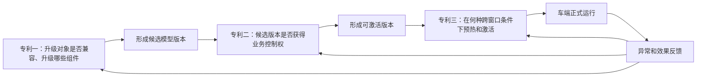

# 智能座舱 AI 端侧模型与 FOTA 三项专利第二轮创新优化框架稿

版本：第二版框架稿  
日期：2026-07-30  
目标：针对第一轮审查评分中的创造性、充分公开和权利要求聚焦问题，重新确定三项发明实质，并作为后续详细技术交底书的统一设计基线。

## 一、第一轮评分复盘

| 专利 | 第一轮得分 | 核心优势 | 主要失分原因 |
|---|---:|---|---|
| 多任务模型分层升级 | 84 | 模型组件、影子执行和局部回滚闭环较完整 | ECU 依赖/原子升级已有公开；接口指纹仍可能被认为静态清单校验 |
| 车端回归验证与自动回滚 | 82 | 同源双跑、关键场景覆盖和一致性回滚价值高 | 影子、灰度、指标回滚分别已有公开；风险公式可能被认为人为规则 |
| 画像感知式 FOTA 调度 | 74 | 阶段化执行和异常反馈较完整 | 停车概率、历史停留和网络选时已有强对比文件；画像容易落入体验规则 |

第二轮不再用“增加更多特征”提高表面复杂度，而是为每项建立唯一、可验证、可产生技术效果的核心机制。

## 二、第二轮组合边界

三项分别保护：

1. 专利一保护模型内部兼容性验证和原子升级范围计算。
2. 专利二保护模型质量放行证书和可撤销切主许可。
3. 专利三保护升级阶段跨窗口延续、预热工件复用和状态租约失效。

## 三、专利一优化框架

### 3.1 第二版主题

**基于双指纹契约的座舱多任务模型原子升级方法**

### 3.2 发明实质

第一版静态接口指纹只能证明清单描述兼容，不能发现算子实现、硬件驱动、量化舍入和内存布局造成的运行时不兼容。第二版增加“动态探针指纹”，将静态契约和车端实际执行结果绑定。

双指纹包括：

1. 静态契约指纹：张量类型、形状、语义、排列、量化尺度、算子集合、运行时接口和状态格式。
2. 动态探针指纹：目标对象在指定硬件上执行一组确定性探针张量后得到的输出摘要、时延区间、内存写集摘要、异常码和状态迁移摘要。

### 3.3 闭环链路

升级清单 -> 静态契约筛选 -> 车端动态探针 -> 双指纹兼容证书 -> 影响闭包 -> 最小原子升级集合 -> 代次化只读张量快照 -> 原子路由提交 -> 状态污染边界回滚 -> 不兼容证据回写。

### 3.4 新增关键机制

1. **双指纹兼容证书**：静态条件和动态探针同时通过才可复用当前对象。
2. **代次化张量快照**：共享骨干输出附带模型代次、预处理版本和状态代次，避免新任务头读取跨版本张量。
3. **状态污染标记**：记录候选对象是否写入共享缓存、时序状态或公共后处理，决定回滚边界是否外扩。
4. **比较交换路由提交**：以对象图摘要和路由代次双条件原子切换。
5. **反例兼容库**：把失败双指纹组合写回后续清单生成和探针选择。

### 3.5 独立权利要求骨架

1. 生成静态契约指纹。
2. 在目标车端硬件执行探针张量并生成动态探针指纹。
3. 根据双指纹产生兼容证书。
4. 仅对无证书或证书失效对象递归扩展影响闭包。
5. 以兼容证书复用当前对象构建混合影子执行图。
6. 使用带代次的只读张量快照验证目标任务头。
7. 以对象图摘要和路由代次原子提交。
8. 根据状态污染标记和依赖关系计算回滚边界。
9. 将失败证据更新到反例兼容库。

### 3.6 预期提升

第一轮 84 分，第二版预计 90-92 分。核心提升来自“静态描述兼容”转变为“静态契约 + 指定硬件动态行为”的双重可验证机制。

## 四、专利二优化框架

### 4.1 第二版主题

**基于不可补偿场景证书的座舱模型安全切换方法**

### 4.2 发明实质

第一版风险评分仍可能被普通高分指标补偿，也可能被认为是人为规则。第二版把验证结果固化成“不可补偿场景覆盖证书”，只有每个关键场景单元都满足样本、置信上界、时延和完整性条件，车端可信模块才签发一次性、可撤销的切主许可。

### 4.3 闭环链路

基线场景格 -> 隐私回放胶囊 -> 同源影子双跑 -> 场景单元序贯检验 -> 不可补偿覆盖证书 -> 一次性切主许可 -> 受限路由切换 -> 许可持续监测/撤销 -> 一致性回滚 -> 失败场景写入下一基线。

### 4.4 新增关键机制

1. **隐私回放胶囊**：保存不可逆输入特征摘要、场景标签、当前模型输出、输入质量和时间关联，不保存原始音视频。
2. **场景单元序贯检验**：对每个关键场景独立累计证据，达到通过或拒绝边界即可停止，减少无效计算。
3. **不可补偿覆盖证书**：关键场景逐项列入通过位图；任何一位未通过，整体证书无效。
4. **一次性切主许可**：绑定候选模型摘要、基线摘要、硬件证明、路由范围和有效期。
5. **可撤销许可**：观察期内出现迟发异常时撤销许可，路由控制器无需重新解释评分即可回滚。
6. **失败场景强化**：撤销原因自动提高下一版本对应场景的样本下界或改为硬阻断场景。

### 4.5 独立权利要求骨架

1. 获取版本化场景格及关键场景集合。
2. 生成隐私回放胶囊并执行同源影子推理。
3. 对各关键场景分别进行序贯统计检验。
4. 生成包含关键场景通过位图的覆盖证书。
5. 仅在位图全通过、完整性和时延门槛通过时签发切主许可。
6. 路由控制器校验许可后限制候选模型生效范围。
7. 观察期持续更新许可状态。
8. 许可撤销时执行模型、配置、路由和状态一致性回滚。
9. 撤销证据更新下一验证基线。

### 4.6 预期提升

第一轮 82 分，第二版预计 89-91 分。核心提升来自把主观综合评分改造成逐场景可验证证书和可撤销的车端控制凭证。

## 五、专利三优化框架

### 5.1 第二版主题

**座舱模型跨窗口预热与状态租约激活方法**

### 5.2 主题调整原因

不再以“用户画像预测升级时间”为核心。已有专利已公开停车概率、网络条件、历史停留和预计升级对象。第二版把发明重心转为模型升级跨多个不连续车辆窗口的技术状态延续。

### 5.3 发明实质

下载、编译、权重映射、试推理和正式激活可能跨越多个停车窗口。系统把可复用结果封装为与硬件、运行时、模型摘要绑定的“预热工件”，并为每个阶段签发具有状态快照、资源边界和失效条件的“状态租约”。车辆状态发生实质变化时租约自动失效；正式激活必须获取新租约并通过实时二次门控。

### 5.4 闭环链路

分片依赖图 -> 短窗口价值密度排序 -> 下载检查点 -> 预热工件生成 -> 状态租约签发 -> 车辆唤醒/状态变化 -> 租约失效或续签 -> 激活前新鲜度校验 -> 原子切换 -> 观察/回滚 -> 按原因更新租约寿命和阶段耗时。

### 5.5 新增关键机制

1. **预热工件**：封装已验证分片、算子编译缓存、权重映射描述、内存布局和试推理摘要。
2. **硬件绑定摘要**：预热工件绑定芯片、驱动、运行时、模型和量化参数，环境变化时禁止复用。
3. **状态租约**：包含阶段、状态快照摘要、资源包络、有效期、失效事件集合和允许动作。
4. **变化向量失效**：车速、挡位、电源、温度、任务负载或运行时版本变化超过阈值时自动撤销租约。
5. **短窗口价值密度**：优先完成能最大程度提高下一阶段可启动性的分片或编译单元。
6. **激活新鲜度门控**：正式切换不得复用预热阶段的旧状态判断，必须获取新激活租约。
7. **原因隔离反馈**：分别更新网络、资源、窗口寿命和版本风险，不污染用户偏好。

### 5.6 独立权利要求骨架

1. 解析升级包分片依赖和预热单元。
2. 根据短窗口价值密度选择下载或预热对象。
3. 生成与硬件环境绑定的预热工件。
4. 根据车况和资源快照签发阶段状态租约。
5. 执行期间计算状态变化向量并判断租约是否失效。
6. 租约失效时保存检查点并停止超出租约范围的动作。
7. 后续窗口验证预热工件环境绑定摘要并续接。
8. 激活前重新签发激活租约并执行二次门控。
9. 原子切换后观察，异常则回滚。
10. 根据失效原因更新租约有效期和阶段资源预测。

### 5.7 预期提升

第一轮 74 分，第二版预计 85-88 分。核心提升来自主动避开“预测何时升级”的拥挤技术路线，转向“跨窗口状态连续性及过期决策阻断”。

## 六、第二版统一写作要求

1. 每份详细稿仍按发明名称、技术领域、现有技术、目的、技术方案、有益效果、附图和权利要求八部分展开。
2. 每项至少包含三个 Mermaid 图：架构图、闭环流程图和状态机/时序图。
3. 每项至少包含三个具体实施例和一个异常实施例。
4. 每项至少包含一条方法独立权利要求和十二条从属权利要求。
5. 算法必须绑定车端张量、模型容器、运行时、资源、路由或槽位，不写成单纯数学规则。
6. 所有“证书、许可、租约”均定义字段、签发条件、校验主体、失效条件和对应物理动作。
7. 具体阈值和公式主要放入从属项与实施例，避免不必要缩小独权。
8. 不编造未经核实的专利公开号、实验结果或申请人内部数据；示例数据明确标注为实施例参数。

## 七、第二版文件计划

1. `三项专利第二轮创新优化框架稿.md`
2. `专利一_基于双指纹契约的座舱多任务模型原子升级方法_第二版详细稿.md`
3. `专利二_基于不可补偿场景证书的座舱模型安全切换方法_第二版详细稿.md`
4. `专利三_座舱模型跨窗口预热与状态租约激活方法_第二版详细稿.md`

本框架完成后，详细稿应严格保持三项技术边界，避免将专利二的质量放行指标写入专利一的升级范围计算，也避免将专利三的窗口选择规则写入专利二的切主证书。
