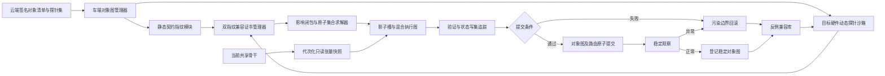
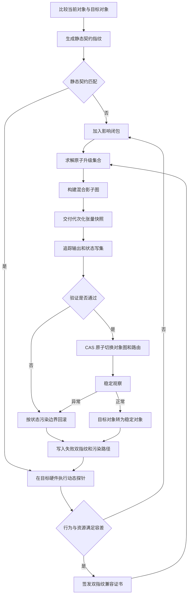
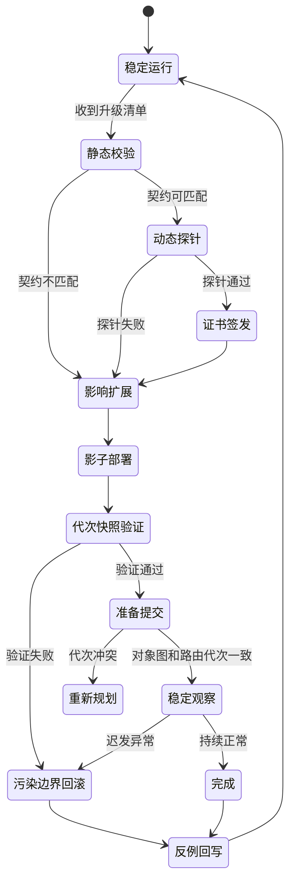

# 专利一：基于双指纹契约的座舱多任务模型原子升级方法

> 第二版详细技术交底书  
> 核心创新：静态契约指纹 + 车端动态探针指纹 + 代次化张量快照 + 状态污染边界回滚

## 1. 发明创造名称

**基于双指纹契约的座舱多任务模型原子升级方法**

## 2. 所属技术领域

本发明属于智能汽车智能座舱、车载人工智能模型部署及车辆空中升级技术领域，具体涉及一种针对共享骨干与多个任务头构成的端侧多任务模型，分别生成静态接口契约指纹和基于目标车端硬件实际执行结果的动态探针指纹，依据双指纹兼容证书确定可复用对象及原子升级范围，并通过代次化张量快照、原子任务路由提交、状态污染边界回滚和失败证据回写实现闭环升级的方法。

## 3. 现有技术

### 3.1 技术背景

智能座舱域控制器可同时运行驾驶员监测、乘员监测、手势识别、视线估计、舱内事件识别、语音交互和多模态理解模型。为节约 NPU 算力，视觉任务常共享骨干网络和中间特征，语音任务也可能共享声学编码器或语义编码器。

现有 OTA/FOTA 已经能够按照 ECU 依赖关系和原子组执行升级，也可在失败时回滚多个软件包。模型部署平台还可使用版本标签、灰度流量和性能指标完成新旧模型切换。因此，仅提出“模型分层、依赖升级、双槽和回滚”难以充分体现创造性。

### 3.2 现有方案的实质缺陷

1. 清单中的接口描述属于发布侧声明，不能证明目标模型在具体芯片、驱动和运行时组合上的实际行为兼容。
2. 文件摘要相同不代表动态行为相同，算子内核、量化舍入、张量对齐和状态缓存差异仍可能导致异常。
3. 静态张量形状匹配不代表任务头可以安全复用当前骨干输出。
4. 影子任务读取共享中间张量时，若未标识模型代次和预处理代次，可能读取跨版本或跨状态的陈旧张量。
5. 局部任务头可能写入共享缓存、公共后处理或时序状态，异常后只恢复任务头会保留污染状态。
6. 兼容性失败通常只形成日志，没有转化为后续升级清单生成和探针选择的机器可执行约束。

### 3.3 第二版要解决的实际技术问题

如何在正式切换前验证“声明接口兼容”与“目标硬件实际行为兼容”同时成立；如何在复用共享骨干时保证中间张量具有正确代次；以及如何根据候选对象对共享状态的实际写入范围确定回滚边界。

## 4. 目的

本发明旨在：

1. 用静态契约指纹描述对象接口，用动态探针指纹验证对象在目标硬件上的真实执行行为。
2. 仅对持有有效双指纹兼容证书的当前对象予以复用。
3. 根据兼容证书缺失或失效位置计算原子升级影响闭包。
4. 通过代次化只读张量快照安全复用共享骨干。
5. 以对象图摘要和路由代次作为原子提交前置条件。
6. 根据候选对象产生的状态污染标记确定最小安全回滚边界。
7. 将失败双指纹、硬件环境和污染路径写入反例兼容库，阻止同类错误重复发生。

## 5. 技术方案及发明要点

### 5.1 分层对象

升级对象至少包括固件、推理运行时、算子库、骨干模型、任务头、前后处理、量化表、校准参数、词表、提示模板和状态转换器中的一种。每个对象具有内容摘要、静态契约、探针配置、依赖关系、资源包络、原子组和回滚属性。

### 5.2 静态契约指纹

对象 \(i\) 的静态契约指纹：

\[
F_i^s=Hash(T_i^{in},T_i^{out},D_i,L_i,Q_i,O_i,A_i,P_i,Z_i)
\]

其中：

1. \(T_i^{in},T_i^{out}\)：输入输出类型及业务语义。
2. \(D_i\)：张量维度。
3. \(L_i\)：内存排列和对齐方式。
4. \(Q_i\)：量化位宽、尺度、零点和舍入方式。
5. \(O_i\)：所需算子及算子版本。
6. \(A_i\)：运行时接口和加速后端。
7. \(P_i\)：前后处理版本。
8. \(Z_i\)：时序状态结构和初始化规则。

内容摘要验证文件是否被改变；静态契约指纹验证对象之间的声明接口是否一致，二者用途不同。

### 5.3 动态探针指纹

升级包为每类对象携带签名探针集。探针集不是训练数据，而是用于触发边界值、量化区间、状态迁移和异常路径的确定性输入张量及期望约束。

在目标车端硬件和候选运行时中执行探针 \(p\)，记录：

\[
r_{i,p}=(h_{out},\Delta_{num},t_{p95},m_{peak},h_{write},e_{code},h_{state})
\]

其中，\(h_{out}\) 为输出摘要，\(\Delta_{num}\) 为相对参考的数值误差区间，\(t_{p95}\) 为时延，\(m_{peak}\) 为峰值内存，\(h_{write}\) 为内存写集摘要，\(e_{code}\) 为异常码，\(h_{state}\) 为状态迁移摘要。

动态探针指纹为：

\[
F_i^d=Hash(env\_id,\{r_{i,p}\}_{p=1}^{n})
\]

其中 \(env\_id\) 绑定芯片、驱动、运行时、算子库、温度档位和量化后端。环境任一关键项改变时，原动态探针指纹失效。

### 5.4 双指纹兼容证书

兼容判定不要求浮点输出逐位一致，而由对象风险等级确定容差。兼容证书至少包括：

| 字段 | 含义 |
|---|---|
| certificate_id | 证书标识 |
| producer_object / consumer_object | 输出对象和消费对象 |
| static_fingerprint_pair | 双方静态契约指纹 |
| dynamic_fingerprint | 动态探针指纹 |
| environment_id | 目标硬件环境摘要 |
| valid_generation | 对象图适用代次 |
| tolerance_profile | 数值、时延和资源容差 |
| state_write_scope | 共享状态写入范围 |
| expiry_condition | 环境、版本或探针变化失效条件 |
| signature | 车端可信模块签名 |

仅当静态契约匹配、动态探针全部通过、资源包络满足且共享状态写入范围可控制时签发兼容证书。

### 5.5 影响闭包与原子升级集合

初始变化集合包括内容变化对象、静态契约变化对象和动态探针失败对象。递归计算：

\[
C_{k+1}=C_k\cup Dep(C_k)\cup InvalidCert(C_k)\cup Atomic(C_k)\cup State(C_k)
\]

其中，\(Dep\) 为未满足硬依赖对象，\(InvalidCert\) 为兼容证书缺失/失效对象，\(Atomic\) 为同一原子组对象，\(State\) 为共享状态格式或写入范围受影响对象。

在闭包中生成候选方案，并以下载量、停机时间、探针成本、资源冲突、回滚能力和安全等级为约束求综合代价最小方案。

### 5.6 代次化张量快照

共享骨干输出的每个快照具有：

\[
S=(tensor,backbone\_gen,preprocess\_gen,state\_gen,frame\_id,timestamp,checksum)
\]

候选任务头声明可接受的代次范围。影子调度器仅在骨干代次、预处理代次、状态代次及校验和均匹配时交付快照。快照缓冲区为只读，候选任务头不得修改当前执行链数据。

若代次不匹配，系统丢弃该快照并等待新快照；连续不匹配达到阈值则兼容证书被撤销，目标任务头进入回滚或重新规划。

### 5.7 状态污染标记

在影子执行期间，通过内存保护页、写时复制或运行时写集追踪记录候选对象对以下状态的写入：

1. 任务私有缓存。
2. 共享骨干缓存。
3. 公共后处理状态。
4. 时序会话状态。
5. 业务路由和配置状态。

状态污染向量：

\[
V_i=(b_{private},b_{backbone},b_{post},b_{session},b_{route})
\]

若候选对象只写入私有状态，可独立回滚；若写入共享状态，则回滚范围沿共享状态消费者扩展，并恢复切换前状态快照。

### 5.8 原子提交

提交令牌绑定目标对象图摘要 \(H(G_t)\)、当前路由代次 \(g_r\)、双指纹证书集合摘要和状态快照摘要。路由控制器执行：

\[
CAS(route,\langle H(G_c),g_r\rangle,\langle H(G_t),g_r+1\rangle)
\]

只有当前对象图和路由代次均未变化时提交成功。并发事务导致任一值变化时，提交失败并重新计算影响闭包。

### 5.9 污染边界回滚

回滚集合以异常对象为起点，加入：

1. 同一原子组对象。
2. 兼容证书依赖异常对象的已提交对象。
3. 读取被污染共享状态的对象。
4. 无法从切换前快照恢复状态的对象。

对回滚后仍持有有效双指纹兼容证书且状态未污染的对象予以保留。回滚通过旧对象图摘要和新路由代次原子切换，并执行健康探针。

### 5.10 反例兼容库闭环

失败记录至少包括静态指纹对、动态指纹、环境摘要、失败探针、数值偏差、写集摘要、异常状态及实际回滚范围。后续升级：

1. 命中相同静态指纹和环境组合时直接阻断复用。
2. 命中相似环境时增加对应探针。
3. 状态污染超出声明范围时修正对象契约。
4. 连续通过的组合可缩短非关键探针，但不得取消安全探针。

### 5.11 总体架构图

### 5.12 闭环流程图

### 5.13 状态机

### 5.14 具体实施例

**实施例一：静态兼容但动态量化失败。** 目标驾驶员监测任务头声明输入张量均为 `1x256x32x32 INT8`，静态契约匹配。车端动态探针发现目标 NPU 驱动采用不同饱和舍入，边界探针输出偏差超过安全容差，系统拒绝签发兼容证书，将量化表和任务头共同加入原子升级集合，而非直接复用当前量化表。

**实施例二：代次快照阻断陈旧张量。** 当前骨干完成升级并产生代次 42 的特征，候选任务头仍只接受骨干代次 41。缓冲区检测代次不匹配，不把张量交付候选任务头，防止形状虽相同但语义已变化的特征进入任务头。

**实施例三：任务头局部回滚。** 手势任务头影子运行期间仅写入私有缓存，状态污染向量为 `(1,0,0,0,0)`。异常时只恢复旧手势任务头，其余任务保持运行。

**实施例四：共享状态污染外扩。** 语音语义任务头更新了公共会话状态，污染向量的会话位为 1。随后唤醒任务出现异常。系统把共享会话状态及其消费者加入回滚边界，恢复切换前会话快照，不执行不安全的单任务头回滚。

## 6. 有益效果

1. 动态探针可发现静态接口无法揭示的硬件、驱动、量化和状态行为不兼容。
2. 双指纹证书使“可复用对象”具有可校验依据。
3. 代次化张量快照阻止跨版本陈旧中间特征被候选任务读取。
4. 状态写集追踪使回滚范围由实际污染路径而非固定包边界决定。
5. 对象图摘要和路由代次双条件提交避免并发升级形成混合版本。
6. 反例兼容库把一次失败转化为后续可执行的阻断条件和探针增强。
7. 可减少不必要的骨干重复部署与整包回滚，提高车端业务连续性。

## 7. 附图及其简要说明

1. 附图 1：系统总体架构图。
2. 附图 2：双指纹兼容、影子验证、提交及回滚闭环图。
3. 附图 3：升级事务状态机。

附图均以 Mermaid 格式给出，可直接渲染。

## 8. 权利要求

### 权利要求 1

一种基于双指纹契约的座舱多任务模型原子升级方法，其特征在于，包括：

获取当前模型对象图和目标模型对象图，根据各模型对象的输入输出类型、张量维度、内存排列、量化参数、算子集合、运行时接口、前后处理规则及状态结构生成静态契约指纹；

在目标车辆的车端硬件环境中，向目标模型对象输入预设探针张量，获取目标模型对象的输出摘要、数值偏差、执行时延、峰值内存、内存写集、异常码及状态迁移中的至少三项，生成与所述车端硬件环境绑定的动态探针指纹；

在相互连接的模型对象的静态契约指纹满足接口约束且动态探针指纹满足预设行为及资源容差时，生成双指纹兼容证书；

根据当前模型对象图与目标模型对象图确定变化对象，并将缺少有效双指纹兼容证书的关联对象、与变化对象存在未满足硬依赖的对象、与变化对象属于同一原子一致性组的对象及共享状态格式受影响的对象递归加入影响闭包；

根据所述影响闭包确定原子升级集合，将目标模型对象部署至影子槽，并使持有有效双指纹兼容证书的未变化模型对象复用当前运行槽，形成混合影子执行图；

将共享骨干模型输出封装为包含骨干模型代次、预处理代次、状态代次及输入序列标识的只读张量快照，在所述只读张量快照的代次满足目标任务头声明的代次约束时，将其提供给目标任务头执行影子验证；

在影子验证通过时，基于目标模型对象图摘要和当前任务路由代次执行原子路由切换；以及

在影子验证或稳定观察发生异常时，根据异常模型对象的依赖关系及其对共享状态的实际写入范围确定状态污染边界，回滚状态污染边界内的模型对象和状态，并将异常对应的双指纹、车端硬件环境及状态写入范围写入反例兼容库。

### 权利要求 2

根据权利要求 1 所述的方法，其特征在于，动态探针指纹绑定芯片型号、驱动版本、推理运行时版本、算子库版本、量化后端及温度档位中的至少三项；任一绑定项变化时动态探针指纹失效。

### 权利要求 3

根据权利要求 1 所述的方法，其特征在于，探针张量包括用于触发量化边界、张量对齐边界、算子异常路径和时序状态迁移中的至少两类确定性输入。

### 权利要求 4

根据权利要求 1 所述的方法，其特征在于，双指纹兼容证书还包括生产对象标识、消费对象标识、适用对象图代次、容差配置、共享状态写入范围、失效条件及车端可信模块签名。

### 权利要求 5

根据权利要求 1 所述的方法，其特征在于，原子升级集合从多个候选集合中依据下载量、预计停机时间、动态探针执行成本、资源冲突风险及回滚能力计算综合代价后确定。

### 权利要求 6

根据权利要求 1 所述的方法，其特征在于，只读张量快照还包括时间戳和数据校验和；任一代次不匹配或校验和失败时丢弃该快照，且不向目标任务头交付。

### 权利要求 7

根据权利要求 1 所述的方法，其特征在于，通过内存保护页、写时复制或运行时写集追踪中的至少一种获取目标模型对象对任务私有缓存、共享骨干缓存、公共后处理状态、会话状态和路由状态的写入范围。

### 权利要求 8

根据权利要求 1 所述的方法，其特征在于，原子路由切换通过比较交换操作完成，比较条件同时包括切换前模型对象图摘要和任务路由代次。

### 权利要求 9

根据权利要求 1 所述的方法，其特征在于，当异常对象仅写入任务私有状态且回滚后其他对象的双指纹兼容证书仍有效时，仅回滚异常对象及其私有状态。

### 权利要求 10

根据权利要求 1 所述的方法，其特征在于，当异常对象写入共享状态时，将读取所述共享状态且无法从切换前状态快照恢复的已生效对象递归加入状态污染边界。

### 权利要求 11

根据权利要求 1 所述的方法，其特征在于，反例兼容库中的记录包括失败探针标识、静态契约指纹对、动态探针指纹、环境摘要、数值偏差、内存写集摘要及实际回滚范围。

### 权利要求 12

根据权利要求 1 所述的方法，其特征在于，后续升级命中反例兼容库中相同静态契约指纹和硬件环境组合时，禁止复用对应当前对象，或者在相似环境组合下增加失败探针对应的探针张量。

### 权利要求 13

根据权利要求 1 所述的方法，其特征在于，在升级状态迁移前写入包含当前对象图摘要、目标对象图摘要、路由代次和状态快照摘要的预备日志，状态迁移完成后写入完成日志；车辆重新上电后依据最后一条校验有效日志恢复升级前路由、继续稳定观察或继续污染边界回滚。

## 审查与申请提示

本申请的创造性中心是双指纹兼容证书驱动后续影响闭包、代次张量复用和污染边界回滚的连续关系，不是普通证书认证、普通接口哈希或普通 OTA 原子组。正式申请前应重点检索动态兼容探针、模型运行时契约、张量代次和内存写集回滚；并以真实硬件测试补充动态探针发现静态兼容误判的技术效果。
