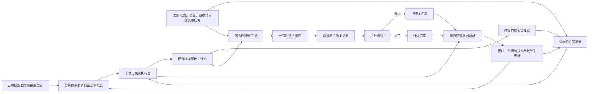
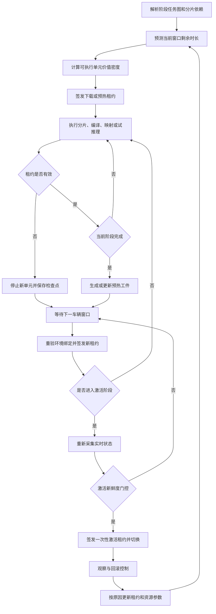
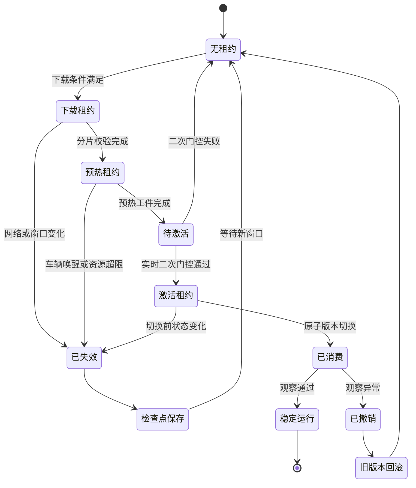

# 专利三：座舱模型跨窗口预热与状态租约激活方法

> 第二版详细技术交底书  
> 核心创新：短窗口价值密度 + 硬件绑定预热工件 + 阶段状态租约 + 状态变化自动失效 + 激活新鲜度二次门控

## 1. 发明创造名称

**座舱模型跨窗口预热与状态租约激活方法**

## 2. 所属技术领域

本发明属于车辆空中升级、智能座舱端侧人工智能模型生命周期管理和车端资源调度技术领域，具体涉及一种将模型升级拆分为可跨多个不连续车辆可用窗口执行的分片下载、模型预热和版本激活阶段，将编译缓存、权重映射、内存布局及试推理结果封装为与硬件环境绑定的预热工件，为各阶段签发具有状态快照、资源边界、有效期限和失效事件的状态租约，并在激活前重新签发激活租约和执行新鲜度门控的方法。

## 3. 现有技术

### 3.1 技术背景

现有车辆 OTA 调度可根据历史停车数据、停车概率、网络状态或预计停留时间选择升级时机；也可依据车辆是否停车、充电和电量是否充足决定是否升级。断点续传能够保存下载进度，A/B 槽可支持版本回滚。

### 3.2 现有技术问题

1. “选择一个升级时间”假设下载、解压、编译、加载和激活可在同一连续窗口完成，不适合大型端侧模型。
2. 下载断点只能保存字节进度，无法保存算子编译、权重映射、内存规划和试推理形成的可复用技术结果。
3. 预热结果若未绑定芯片、驱动、运行时和模型摘要，后续窗口可能错误复用过期缓存。
4. 调度器在窗口开始时作出的允许判断可能在正式激活时已经过期。
5. 车辆唤醒、远程空调、导航重规划、温度上升或高优先级任务会改变资源边界，但现有任务仍可能机械继续。
6. 普通暂停标志不能说明暂停前允许执行哪些动作、何时失效、恢复时需要重验哪些条件。
7. 中断结果若只记为成功或失败，无法分别修正窗口寿命、网络速率、预热资源和版本风险。

### 3.3 第二版实际技术问题

如何使大型座舱模型升级安全跨越多个不连续车辆窗口，复用已完成的编译和映射结果，同时阻止基于陈旧车况和资源判断的正式激活。

## 4. 目的

本发明旨在：

1. 使模型分片下载、预热和激活分别在不同车辆窗口执行。
2. 把可复用预热结果封装为可校验、可迁移到后续窗口的预热工件。
3. 通过硬件绑定摘要防止环境变化后错误复用预热工件。
4. 以阶段状态租约限定当前窗口内允许动作、资源包络、有效期限和失效事件。
5. 通过状态变化向量实时撤销过期租约。
6. 激活前必须重新获取激活租约，禁止沿用下载或预热阶段的旧许可。
7. 按租约失效原因分别修正窗口、网络、资源和版本风险参数。

## 5. 技术方案及发明要点

### 5.1 阶段任务图

升级任务拆分为：

1. 分片下载阶段。
2. 完整性和依赖校验阶段。
3. 算子编译阶段。
4. 权重映射及内存规划阶段。
5. 隔离试推理阶段。
6. 正式激活阶段。
7. 稳定观察和回滚阶段。

各节点具有输入工件、输出工件、资源包络、可否中断、检查点格式及前置依赖。

### 5.2 短窗口价值密度

对可执行单元 \(u_i\) 计算：

\[
VD_i=\frac{\lambda_1K_i+\lambda_2P_i+\lambda_3R_i+\lambda_4U_i}
{\widehat T_i+\mu_1E_i+\mu_2M_i}
\]

其中：

1. \(K_i\)：对后续关键路径的缩短量。
2. \(P_i\)：完成后使下一阶段可启动的贡献。
3. \(R_i\)：已有缓存复用收益。
4. \(U_i\)：任务紧迫度。
5. \(\widehat T_i\)：预计耗时。
6. \(E_i\)：能耗。
7. \(M_i\)：峰值内存。

系统在短窗口内优先执行价值密度高且可在剩余租约期限内完成的单元，而非按升级文件物理顺序执行。

### 5.3 预热工件

预热工件至少包括：

| 字段 | 含义 |
|---|---|
| artifact_id | 工件标识 |
| model_digest | 模型及配置摘要 |
| chunk_bitmap | 已验证分片位图 |
| compiler_cache_digest | 算子编译缓存摘要 |
| weight_map | 权重到设备内存的映射描述 |
| memory_plan | 内存布局及峰值需求 |
| probe_result | 隔离试推理结果摘要 |
| environment_binding | 芯片、驱动、运行时、算子库和量化后端 |
| dependency_digest | 依赖图摘要 |
| checkpoint | 可恢复执行位置 |
| expiry_condition | 环境变化和最长保存期限 |
| integrity_signature | 完整性签名 |

预热工件不包含正式业务路由状态，因此生成工件不会使候选模型获得业务控制权。

### 5.4 环境绑定与复用

环境绑定摘要：

\[
H_{env}=Hash(chip,driver,runtime,operator,quantizer,model,config)
\]

后续窗口恢复时重新计算 \(H_{env}'\)。只有 \(H_{env}'=H_{env}\)、依赖摘要一致、工件未过期且完整性签名有效时，才允许复用编译缓存、权重映射和试推理结果。

若驱动或运行时变化，但模型分片仍有效，则保留分片下载结果，废弃受影响的编译和映射工件，并从最近有效节点继续。

### 5.5 阶段状态租约

状态租约定义当前阶段在特定状态快照下暂时获得的执行权限：

| 字段 | 含义 |
|---|---|
| lease_id | 租约标识 |
| task_id / stage_id | 升级任务和阶段 |
| snapshot_digest | 车况、资源、网络和高优先级任务快照 |
| allowed_actions | 下载、编译、映射、试推理或激活 |
| resource_envelope | 带宽、CPU/NPU、内存、温度和能耗上限 |
| valid_from / valid_until | 有效时间 |
| invalidation_events | 车门、挡位、唤醒、任务冲突、温度等事件 |
| max_state_delta | 允许状态变化阈值 |
| artifact_scope | 可使用的预热工件 |
| nonce / counter | 防重放标识 |
| signature | 可信模块签名 |

下载租约可允许受限蜂窝网络和低带宽；预热租约可允许 NPU 使用但禁止切换路由；激活租约必须要求车辆状态、回滚能力和高优先级任务均满足更严格条件。

### 5.6 状态变化向量和租约失效

在执行期间计算：

\[
\Delta X_t=(\Delta v,\Delta gear,\Delta power,\Delta temp,\Delta cpu,
\Delta npu,\Delta mem,\Delta net,\Delta priority)
\]

发生以下任一条件时租约失效：

1. 当前时间超过 `valid_until`。
2. 发生租约列出的失效事件。
3. 状态变化向量超过对应最大阈值。
4. 预热工件环境绑定失配。
5. 高优先级车辆任务请求超出租约预留。
6. 租约被可信控制器主动撤销。

租约失效后，执行器不能启动新的不可中断单元；对正在执行的单元，根据阶段策略完成最小原子步骤或回到检查点。

### 5.7 跨窗口恢复

窗口结束时保存：

1. 已下载字节及分片摘要。
2. 已验证分片位图。
3. 已完成编译单元及缓存摘要。
4. 权重映射和内存规划。
5. 试推理结果。
6. 当前任务图节点和恢复入口。
7. 租约失效原因。

后续窗口重新校验工件环境绑定，签发新租约后从最近有效节点恢复，而不是从头执行。

### 5.8 激活新鲜度二次门控

正式激活不得使用下载租约或预热租约。激活控制器重新采集：

1. 车速、挡位、点火和车门状态。
2. 电量、电压及回滚能量预算。
3. 芯片温度、可用内存和高优先级任务。
4. 当前运行模型和候选模型摘要。
5. 预热工件完整性和环境绑定。
6. 旧版本健康状态和回滚槽完整性。

只有上述条件满足，才签发短有效期的一次性激活租约。版本指针切换时校验租约随机数和状态快照摘要，防止签发后状态变化仍执行切换。

### 5.9 激活、观察和回滚

激活通过原子版本指针切换完成。观察期采集时延、异常输出、进程重启、内存和温升。指标超限时撤销激活租约派生的运行许可，切回旧版本；旧版本健康检查失败则进入最小风险功能模式。

### 5.10 原因隔离反馈

租约结束记录计划寿命、实际寿命、失效原因、阶段进度、资源偏差和工件复用结果：

1. 网络变化只更新网络吞吐和下载租约参数。
2. 车辆起步只更新场景窗口寿命。
3. 温度/资源超限只更新预热资源包络。
4. 工件环境失配更新环境绑定规则。
5. 模型试推理或激活异常更新版本风险。
6. 用户主动取消只更新交互偏好，不修改技术失败率。

参数更新：

\[
\theta_{n+1}=(1-\eta c_n)\theta_n+\eta c_ny_n
\]

其中 \(c_n\) 由原因识别置信度、工件完整性和状态日志完整度确定。

### 5.11 总体架构图

### 5.12 跨窗口闭环流程图

### 5.13 租约状态机

### 5.14 具体实施例

**实施例一：服务区短窗口。** 模型包尚有 600MB 和三个编译单元。预计窗口 9 分钟。价值密度计算表明模型结构、量化表和第一关键权重分片可使后续预热提前启动，系统只下载这些对象；租约到期后保存分片位图，不执行编译和激活。

**实施例二：住宅窗口生成预热工件。** 后续住宅停车窗口签发预热租约，完成剩余下载、算子编译、权重映射和试推理，生成与当前 NPU 驱动绑定的工件。用户临时远程启动空调导致温度和 NPU 负载超限，租约失效，系统保存编译缓存和映射检查点。

**实施例三：驱动变化导致部分工件失效。** 车辆在下一窗口先完成 NPU 驱动升级。环境摘要变化，旧算子编译缓存和权重映射被废弃，但已验证模型分片继续复用；系统只重新编译和映射，不重新下载完整包。

**实施例四：激活前状态变化。** 激活租约签发后驾驶座被占用且挡位由 P 切换至 D，状态变化超过租约阈值。版本指针控制器拒绝消费该租约，候选模型保持未激活，待下一个安全窗口重新签发。

## 6. 有益效果

1. 大型模型升级可跨多个不连续窗口延续。
2. 预热工件把算子编译、权重映射和试推理结果转化为可复用技术资产。
3. 环境绑定避免驱动或运行时变化后错误使用旧缓存。
4. 阶段状态租约明确当前窗口内允许动作和资源上限。
5. 状态变化自动失效阻止陈旧升级决策继续执行。
6. 激活前新鲜度门控避免沿用预热时的旧车况。
7. 原因隔离反馈提高窗口寿命和资源估计的准确性。
8. 相比只保存下载断点，可显著减少跨窗口重复编译和试推理。

## 7. 附图及其简要说明

1. 附图 1：跨窗口预热和激活系统架构图。
2. 附图 2：跨窗口检查点、工件复用和激活闭环图。
3. 附图 3：阶段状态租约状态机。

附图均以 Mermaid 格式给出。

## 8. 权利要求

### 权利要求 1

一种座舱模型跨窗口预热与状态租约激活方法，其特征在于，包括：

获取智能座舱模型升级任务，将所述升级任务解析为具有前置依赖、资源包络、可中断属性和检查点格式的分片下载单元、模型预热单元及模型激活单元；

根据车辆当前可用窗口的预计剩余时长，以及各可执行单元对后续关键路径的缩短量、对下一阶段可启动性的贡献、预计耗时、能耗和峰值内存，确定当前可用窗口内的目标可执行单元；

基于车辆运行状态、座舱计算资源状态、网络状态和高优先级车辆任务生成状态快照，并签发与目标可执行单元对应的阶段状态租约，所述阶段状态租约至少包括允许动作、资源包络、有效期限、失效事件集合、最大状态变化阈值及防重放标识；

在阶段状态租约有效期间执行目标可执行单元，将已验证模型分片、算子编译缓存、权重映射、内存布局及隔离试推理结果中的至少两项封装为预热工件，并使所述预热工件绑定芯片、驱动、推理运行时、算子库、量化后端、模型及配置的环境摘要；

在执行期间计算车辆运行状态、座舱计算资源状态、网络状态及高优先级车辆任务相对所述状态快照的状态变化，在发生租约失效事件、状态变化超过最大状态变化阈值或有效期限届满时，使阶段状态租约失效，停止启动新的不可中断单元并保存当前执行检查点；

在后续车辆可用窗口中重新计算环境摘要，在重新计算的环境摘要与预热工件绑定的环境摘要一致且预热工件完整性校验通过时，签发新的阶段状态租约并从所述执行检查点继续模型预热；

在模型激活前重新采集实时车辆状态、实时座舱计算资源状态、候选模型和当前模型摘要、旧版本回滚状态及预热工件状态，执行激活新鲜度门控，并仅在激活新鲜度门控通过时签发一次性激活租约；

由版本切换控制器在一次性激活租约有效且其状态快照仍满足激活条件时，原子切换模型版本指针；以及

根据阶段状态租约的失效原因、预热工件复用结果及激活后的运行结果，分别更新可用窗口寿命参数、网络参数、预热资源参数或候选模型版本风险参数。

### 权利要求 2

根据权利要求 1 所述的方法，其特征在于，可执行单元的选择依据其对后续关键路径缩短量、下一阶段可启动性贡献、缓存复用收益和紧迫度之和与预计耗时、能耗和峰值内存之和的比值确定。

### 权利要求 3

根据权利要求 1 所述的方法，其特征在于，预热工件还包括已验证分片位图、依赖图摘要、试推理摘要、恢复入口、最长保存期限和完整性签名。

### 权利要求 4

根据权利要求 1 所述的方法，其特征在于，当重新计算的环境摘要与预热工件绑定的环境摘要不一致时，保留环境无关的已验证模型分片，并废弃受环境变化影响的算子编译缓存、权重映射或内存布局。

### 权利要求 5

根据权利要求 1 所述的方法，其特征在于，阶段状态租约根据下载阶段、模型预热阶段和模型激活阶段分别设置不同的带宽、处理器、神经网络处理器、内存、温度和能耗上限。

### 权利要求 6

根据权利要求 1 所述的方法，其特征在于，租约失效事件包括车门开启、驾驶座占用、挡位变化、车辆唤醒、电源状态变化、芯片温度超限、内存压力超限、网络类型变化及高优先级车辆任务启动中的至少一项。

### 权利要求 7

根据权利要求 1 所述的方法，其特征在于，状态变化包括车速、挡位、电源、芯片温度、处理器占用、神经网络处理器占用、内存、网络和高优先级车辆任务相对状态快照的变化。

### 权利要求 8

根据权利要求 1 所述的方法，其特征在于，阶段状态租约失效时，对正在执行的不可中断单元完成预设最小原子步骤，对其他单元停止执行并记录已完成节点、输出工件摘要和恢复入口。

### 权利要求 9

根据权利要求 1 所述的方法，其特征在于，激活新鲜度门控至少校验车辆挡位和车速、电量或电压、芯片温度、可用内存、高优先级任务、候选模型摘要、预热工件完整性及旧版本回滚槽完整性。

### 权利要求 10

根据权利要求 1 所述的方法，其特征在于，一次性激活租约具有短于下载阶段和预热阶段状态租约的有效期限，并绑定激活前状态快照摘要、候选模型摘要、目标版本指针和一次性随机数。

### 权利要求 11

根据权利要求 1 所述的方法，其特征在于，版本切换控制器在消费一次性激活租约前重新比较当前状态快照摘要，在摘要不一致时拒绝切换模型版本指针。

### 权利要求 12

根据权利要求 1 所述的方法，其特征在于，候选模型激活后在观察期采集推理时延、异常输出比例、进程重启、内存占用及芯片温升，并在任一指标超过对应阈值时原子切回旧版本。

### 权利要求 13

根据权利要求 1 所述的方法，其特征在于，网络变化只更新网络参数，车辆起步更新可用窗口寿命参数，温度或资源超限更新预热资源参数，预热工件环境失配更新环境绑定规则，候选模型异常更新版本风险参数。

## 审查与申请提示

本申请应避免重新落回“预测用户何时停车并选择升级时间”。创造性应集中于跨窗口预热工件、阶段状态租约、状态变化自动失效和激活前新鲜度门控之间的连续控制关系。正式申请前应检索 OTA 检查点、编译缓存复用、租约式资源调度和车辆激活令牌，并补充跨三个不连续窗口完成大型模型升级的对照实验。
