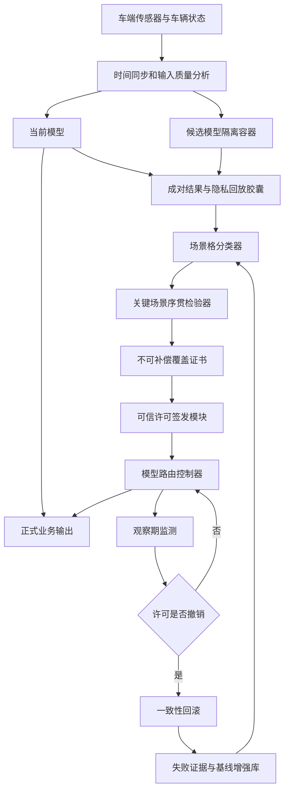
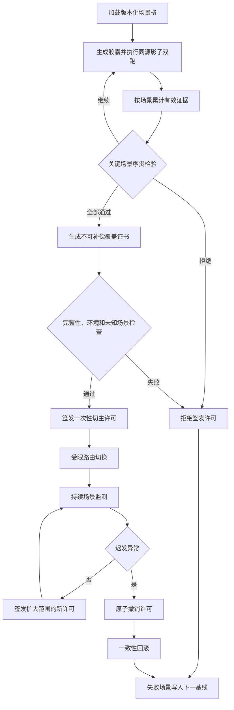
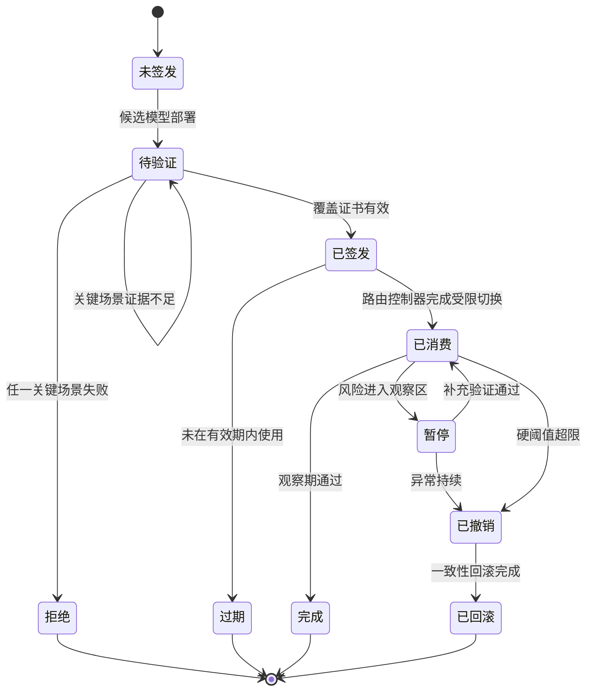

# 专利二：基于不可补偿场景证书的座舱模型安全切换方法

> 第二版详细技术交底书  
> 核心创新：隐私回放胶囊 + 关键场景序贯检验 + 不可补偿覆盖证书 + 一次性可撤销切主许可

## 1. 发明创造名称

**基于不可补偿场景证书的座舱模型安全切换方法**

## 2. 所属技术领域

本发明属于智能座舱端侧人工智能模型验证、车辆软件升级控制及功能安全技术领域，具体涉及一种将真实车端输入转换为不可逆的隐私回放胶囊，对候选模型在各关键场景单元中分别执行序贯统计检验，生成关键场景结果不可由普通场景补偿的覆盖证书，并由车端可信模块据此签发一次性、可撤销的模型切主许可，从而控制候选模型灰度、生效、撤销和一致性回滚的方法。

## 3. 现有技术

### 3.1 技术背景

候选座舱模型升级后通常通过启动检查、离线测试、影子运行或小流量灰度验证。常规模型平台能够根据性能指标调整流量，指标降低时回滚旧版本。车辆 OTA 也可根据进程异常和设备依赖实施回滚。

### 3.2 现有技术问题

1. 总体准确率或综合风险分数会把多个场景平均，少量高风险场景退化可能被大量普通样本抵消。
2. 关键场景样本不足时，简单样本比例无法证明候选模型达到安全边界。
3. 影子验证结果通常只存于日志，路由控制器没有一个可以直接校验的放行对象。
4. 从“验证通过”到“切主执行”之间存在状态变化，旧验证结果可能被重复使用或跨车型使用。
5. 灰度观察期间发现迟发异常时，系统需要重新解释多个指标才能决定回滚，响应链较长。
6. 保存原始音视频作为回放数据会增加隐私和存储风险。
7. 回滚失败场景未自动进入下一版本的强制覆盖集合。

### 3.3 实际技术问题

如何把分散的场景验证数据转换为一个不可被平均分数绕过、可由车端路由控制器直接校验、具有适用范围和撤销状态的技术凭证，并在迟发异常时快速撤销候选模型控制权。

## 4. 目的

本发明旨在：

1. 在不保存原始敏感音视频的情况下复现候选模型关键输入条件。
2. 对每个关键场景独立评估，不允许其他场景的良好结果补偿。
3. 使用序贯检验在达到足够证据后提前通过或拒绝，降低车端验证成本。
4. 将验证结果封装为覆盖证书，并签发绑定模型、硬件、基线、路由范围和有效期的一次性切主许可。
5. 在观察期发现迟发异常时撤销许可，由路由控制器立即回滚。
6. 将撤销原因和失败场景写入下一版本场景基线，形成持续增强闭环。

## 5. 技术方案及发明要点

### 5.1 场景格

将任务、环境、人员状态、车辆状态、输入质量、资源状态和故障状态离散为场景格：

\[
g_j=(task,env,occupant,vehicle,input,resource,fault)
\]

场景格分为关键场景集合 \(G_c\) 和一般场景集合 \(G_n\)。关键场景由功能危害分析、法规需求、历史回滚记录和模型适用边界共同确定。

每个关键场景至少配置：

1. 最低有效样本量。
2. 目标错误率或性能下界。
3. 置信水平。
4. 时延和资源硬阈值。
5. 输入质量阈值。
6. 允许连续异常次数。

### 5.2 隐私回放胶囊

真实输入只在车端易失缓冲区处理。系统形成：

| 字段 | 含义 |
|---|---|
| capsule_id | 胶囊标识 |
| scene_cell_id | 场景单元 |
| feature_sketch | 不可逆特征摘要或随机投影 |
| current_output | 当前模型输出及置信度摘要 |
| quality_vector | 光照、噪声、遮挡、丢帧等质量信息 |
| timing_vector | 输入序列和时间关系 |
| state_digest | 时序模型初始状态摘要 |
| replay_adapter | 候选模型输入适配标识 |
| expiry | 胶囊过期条件 |
| integrity_tag | 完整性校验 |

对允许本地短时回放的场景，胶囊可包含经脱敏、加密且具有自动删除期限的局部特征张量；对不允许回放的场景，只保留统计摘要并使用在线同源双跑结果。

### 5.3 同源影子双跑

当前模型与候选模型接收同一输入序列、相同预处理版本和可比较初始状态。候选输出隔离，不驱动车辆提示或交互。成对结果至少包括语义差异、高风险事件差异、置信度、时序抖动、P99 时延、内存及温升。

输入时间差、数据质量或状态同步不满足要求时，该样本标记为无效，不能增加对应场景的通过证据。

### 5.4 场景单元序贯检验

对场景 \(j\) 的每一个有效样本计算候选模型相对基线的退化事件 \(x_{j,n}\)。设可接受退化率上限为 \(p_0\)，不可接受退化率下限为 \(p_1\)，其中 \(p_1>p_0\)。

累计对数似然比：

\[
L_{j,n}=\sum_{k=1}^{n}\log\frac{P(x_{j,k}|p_1)}{P(x_{j,k}|p_0)}
\]

通过边界和拒绝边界分别为：

\[
A=\log\frac{1-\beta}{\alpha},\quad B=\log\frac{\beta}{1-\alpha}
\]

当 \(L_{j,n}\le B\) 且最低样本量满足时，场景通过；当 \(L_{j,n}\ge A\) 时，场景拒绝；处于二者之间则继续收集样本。对于难以采用伯努利事件的连续指标，可使用置信上界、分位数置信区间或非劣效性检验。

关键场景的时延、完整性或安全事件硬阈值一旦超限，直接拒绝，不进入补偿计算。

### 5.5 不可补偿场景覆盖证书

证书包括：

1. 候选模型摘要和当前模型摘要。
2. 验证基线摘要。
3. 场景格版本。
4. 关键场景通过位图 \(B_c\)。
5. 各场景样本量、统计量和置信结果摘要。
6. 未知场景比例。
7. 硬阈值检查结果。
8. 硬件和运行时证明摘要。
9. 证书有效期和失效条件。
10. 可信模块签名。

证书有效条件：

\[
ValidCert=\left(\bigwedge_{j\in G_c}pass_j\right)
\land Integrity \land Runtime \land UnknownRate
\]

一般场景可采用加权统计，但不能改变任何关键场景的失败位。由此实现“不可补偿”。

### 5.6 一次性切主许可

覆盖证书有效后，许可签发模块生成：

\[
Permit=(model,cert,vehicle,route,quota,expiry,nonce,status)
\]

其中：

1. `model`：候选模型摘要。
2. `cert`：覆盖证书摘要。
3. `vehicle`：车型、硬件和运行时证明。
4. `route`：允许生效的任务和场景。
5. `quota`：交互次数、请求比例或观察时长。
6. `expiry`：有效期。
7. `nonce`：一次性随机数，防止重复使用。
8. `status`：有效、暂停、撤销或消费完成。

路由控制器只接受签名有效、未过期、未使用、未撤销且适用环境一致的许可。许可一旦用于切换即标记为已消费，扩大灰度范围需要签发新许可。

### 5.7 持续监测与许可撤销

灰度或切主后持续按场景更新：

1. 安全事件漏检。
2. 置信分布变化。
3. 连续帧抖动。
4. 截止时间超限。
5. 内存、温度和进程健康。
6. 未知场景比例。

任一硬阈值超限，或关键场景的序贯统计进入拒绝边界时，许可状态原子更新为撤销。路由控制器检测撤销状态后停止向候选模型分发新请求，并进入一致性回滚，无需等待重新计算总体评分。

### 5.8 一致性回滚

回滚包括：

1. 冻结候选模型新请求。
2. 处理或丢弃在途请求。
3. 恢复已验证模型、配置和路由。
4. 恢复兼容会话状态；不兼容时使用安全默认状态。
5. 执行旧版本健康探针。
6. 失败时进入最小风险模式。

当异常仅位于独立任务头时执行任务级回滚；异常涉及共享骨干、前处理或公共状态时回滚依赖闭包。

### 5.9 基线增强闭环

每次拒绝或撤销生成失败证据：

1. 失败场景单元。
2. 触发样本胶囊摘要。
3. 序贯统计轨迹。
4. 硬阈值触发项。
5. 模型和环境摘要。
6. 实际回滚范围。

后续同模型族升级时：

1. 失败场景自动加入关键集合。
2. 提高最低样本量或置信水平。
3. 增加对应胶囊或在线采集任务。
4. 对连续稳定场景降低非关键冗余，但不取消关键位。

### 5.10 总体架构图

### 5.11 许可闭环流程图

### 5.12 许可状态机

### 5.13 具体实施例

**实施例一：总体精度提升但关键场景拒绝。** 候选 DMS 总体准确率提高 1.6%，但“夜间+眼镜+偏头”场景的序贯统计达到拒绝边界。对应关键位为 0，覆盖证书无效，总体提升不能补偿，许可不签发。

**实施例二：样本不足保持影子。** “逆光+道路颠簸”场景没有达到最低有效样本量，统计量尚未到通过或拒绝边界。系统保持候选模型影子运行，不以总覆盖率代替该关键场景。

**实施例三：许可一次性消费。** 语音模型获得仅覆盖非驾驶场景、5% 交互次数、24 小时有效的许可。首次切换后随机数被登记为已消费，不能用于扩大到 20%；系统需要依据新观察证据签发新许可。

**实施例四：迟发异常撤销。** 候选模型切主后在高速风噪场景出现连续截止时间超限，许可被原子撤销。路由控制器立即停止新请求并切回旧模型，失败场景进入下一版本关键场景集合。

## 6. 有益效果

1. 关键场景结果不可被总体平均指标掩盖。
2. 序贯检验可在证据充分时提前结束，降低车端验证计算量。
3. 隐私回放胶囊减少原始音视频持久化。
4. 覆盖证书使验证结果成为可校验、可审计的技术对象。
5. 一次性许可防止旧验证结果被重复使用或跨环境使用。
6. 许可撤销把迟发异常直接转换为路由回滚动作。
7. 失败场景自动增强后续基线，形成可持续闭环。

## 7. 附图及其简要说明

1. 附图 1：系统架构图。
2. 附图 2：场景验证、证书、许可和回滚闭环图。
3. 附图 3：切主许可状态机。

附图均以 Mermaid 格式给出。

## 8. 权利要求

### 权利要求 1

一种基于不可补偿场景证书的座舱模型安全切换方法，其特征在于，包括：

获取与候选座舱模型绑定的版本化场景格，将所述场景格中的场景单元划分为关键场景单元和一般场景单元，并为各关键场景单元配置最低有效样本量、统计判定边界及至少一个不可补偿硬阈值；

将车端真实输入转换为包含场景单元标识、不可逆输入特征摘要、输入质量、时间关系、当前模型输出摘要及状态摘要的隐私回放胶囊，并使当前模型和候选座舱模型基于时间对齐的同源输入执行推理，其中候选座舱模型的输出与正式座舱业务隔离；

根据当前模型和候选座舱模型的成对输出及运行遥测数据，分别针对各关键场景单元累计有效验证证据，并对各关键场景单元执行序贯统计检验，以确定通过、拒绝或继续验证状态；

在全部关键场景单元达到通过状态且均未触发不可补偿硬阈值时，生成包含关键场景通过位图、各关键场景统计结果摘要、候选模型摘要、验证基线摘要、车端硬件环境摘要及有效期的不可补偿场景覆盖证书；

根据所述不可补偿场景覆盖证书签发一次性模型切主许可，所述一次性模型切主许可绑定允许生效的模型任务、场景范围、请求配额、观察期限、一次性标识及撤销状态；

由模型路由控制器在所述一次性模型切主许可签名有效、未过期、未被使用、未被撤销且车端硬件环境匹配时，使候选座舱模型在所述一次性模型切主许可限定的范围内生效；

在候选座舱模型生效后继续按场景单元采集运行证据，并在任一关键场景单元触发拒绝状态或不可补偿硬阈值时，原子撤销所述一次性模型切主许可；以及

响应于许可撤销，将模型路由、模型版本、运行配置和兼容状态恢复至已验证版本，并将导致许可撤销的关键场景单元及验证证据写入后续版本化场景格。

### 权利要求 2

根据权利要求 1 所述的方法，其特征在于，隐私回放胶囊不包含可直接还原的原始车内图像或音频，并具有过期时间和完整性校验标签。

### 权利要求 3

根据权利要求 1 所述的方法，其特征在于，场景单元由任务类型、光照或噪声条件、人员状态、车辆运行状态、输入质量、计算资源状态和故障状态中的至少三项组合形成。

### 权利要求 4

根据权利要求 1 所述的方法，其特征在于，序贯统计检验基于可接受退化率和不可接受退化率计算累计似然比，并在累计似然比分别达到通过边界或拒绝边界时结束对应关键场景单元的验证。

### 权利要求 5

根据权利要求 1 所述的方法，其特征在于，不可补偿硬阈值包括安全事件漏检、关键场景覆盖不足、模型或配置完整性失败、连续推理截止时间超限和候选模型运行异常中的至少一项。

### 权利要求 6

根据权利要求 1 所述的方法，其特征在于，一般场景单元采用加权覆盖度进行评价，但一般场景单元的评价结果不改变关键场景通过位图中的任一失败位。

### 权利要求 7

根据权利要求 1 所述的方法，其特征在于，不可补偿场景覆盖证书还包括各关键场景单元的有效样本量、统计置信结果、未知场景比例和推理运行时证明，并由车端可信模块签名。

### 权利要求 8

根据权利要求 1 所述的方法，其特征在于，一次性模型切主许可包括随机数或单调计数器；模型路由控制器使用许可完成一次路由切换后，将所述许可标记为已消费。

### 权利要求 9

根据权利要求 1 所述的方法，其特征在于，扩大候选座舱模型的生效任务、场景范围或请求配额时，基于扩大前观察期产生的新增验证证据签发新的模型切主许可。

### 权利要求 10

根据权利要求 1 所述的方法，其特征在于，许可撤销状态存储于模型路由控制器可实时读取的可信状态区，模型路由控制器检测到撤销状态后停止向候选座舱模型分发新请求。

### 权利要求 11

根据权利要求 1 所述的方法，其特征在于，恢复至已验证版本包括冻结候选模型新增请求、恢复已验证模型和配置、原子切换模型路由、恢复兼容会话状态及执行旧版本健康探针。

### 权利要求 12

根据权利要求 1 所述的方法，其特征在于，当异常涉及共享骨干模型、共享前处理或公共时序状态时，回滚依赖所述共享对象或公共时序状态的模型组件；当异常仅涉及接口独立的任务头时执行任务头级回滚。

### 权利要求 13

根据权利要求 1 所述的方法，其特征在于，后续版本化场景格将导致许可撤销的场景单元设置为关键场景单元，并提高对应最低有效样本量、统计置信水平或不可补偿硬阈值的严格度。

## 审查与申请提示

本申请的发明实质不是普通影子测试、综合风险评分或电子证书，而是关键场景逐项序贯验证的不可补偿结果直接约束一次性、可撤销的模型路由许可。正式申请前应重点检索安全场景覆盖、软件放行证书、可撤销能力令牌和车端模型灰度，并补充至少一个总体指标提升但关键场景证书被拒绝的对照实验。
