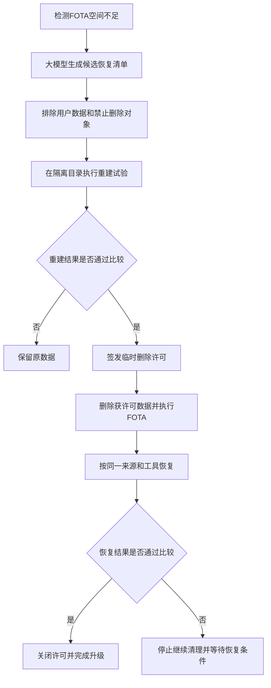
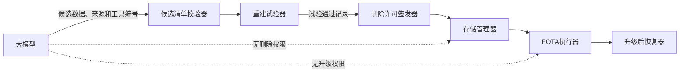

# 基于大模型可恢复数据识别的座舱FOTA腾空间方法

> 第四版初稿。本文只解决一个问题：座舱存储空间不足时，如何在不误删用户数据的前提下，为FOTA临时腾出空间。

## 一句话创新

**大模型只负责找出“可能可以重新生成的数据”；车辆必须在删除前实际完成一次重建试验，只有试验成功的数据才允许被删除，升级后再按同一重建方法恢复。**

本申请不把“大模型清理缓存”“空间调度”或“备用分区”作为创新点。核心是“先证明能恢复，再允许删除”。

## 1. 发明创造名称

**基于大模型可恢复数据识别的座舱FOTA腾空间方法**

## 2. 所属技术领域

本发明涉及智能座舱固件空中升级、车载存储管理和数据恢复技术领域，具体涉及在FOTA可用空间不足时，利用大模型识别候选可恢复数据，并通过删除前重建试验确定可删除对象的方法。

## 3. 现有技术

### 3.1 实际问题

智能座舱长期运行后会积累地图切片、媒体缩略图、语音临时资源、应用缓存和诊断中间文件。FOTA通常还需要同时保存下载包、解压文件、旧版本回退文件和新版本镜像。当剩余空间不足时，升级可能无法开始或在写入过程中失败。

现有做法主要有三类：预留固定升级空间、借用其他分区、按照固定目录清理缓存。前两类会长期占用存储；后一类依赖人工维护目录名单，面对不同车型、供应商和软件版本时容易漏清或误删。仅凭文件名、目录名或最近访问时间，也无法判断数据是否真的能够恢复。

### 3.2 最接近公开

1. [CN117472414A](https://patents.google.com/patent/CN117472414A/zh)在OTA空间不足时调用业务数据备用分区存储升级包，重点是备用分区，并未在删除前验证业务数据能否恢复。
2. [US20170090901A1](https://patents.google.com/patent/US20170090901A1/en)通过分段复制、补丁或归档降低软件更新所需空间，重点是更新文件处理方式，并未识别和验证车内可恢复数据。
3. [CN113094072A](https://patents.google.com/patent/CN113094072A/zh)关注车辆升级时间和蓄电池供电风险，并不解决存储数据安全删除问题。
4. [CN121143846A](https://patents.google.com/patent/CN121143846A/zh)利用大模型生成OTA故障修复方案，接近“大模型辅助OTA”，但没有“删除前重建试验”及升级后恢复闭环。

本轮关键词和动作链检索中，尚未发现单篇文献同时公开：由大模型提出车内可恢复数据、在删除原数据前实际重建、以重建结果签发删除许可，以及FOTA后按同一方法恢复。该结论是当前检索判断，不等同于保证具备新颖性。

### 3.3 需要主动避开的表述

- 不主张普通缓存清理、垃圾回收或最近最少使用删除；
- 不主张备用分区、A/B分区或升级包分片本身；
- 不允许大模型直接删除文件或决定用户数据是否重要；
- 不把“模型判断可恢复”作为删除依据。

## 4. 目的

本发明旨在解决座舱FOTA因临时空间不足而失败，以及固定缓存清理规则可能误删个性化数据的问题。通过删除前的实际重建试验，将“模型推测可恢复”转换为“车辆已经验证可恢复”，在释放存储空间的同时保留用户数据安全边界。

## 5. 技术方案及发明要点

### 5.1 唯一核心创新

对每一项准备删除的数据，先在隔离目录中按照指定数据来源和重建工具生成替代数据；只有替代数据通过确定性比较，才向存储管理器签发该数据的临时删除许可。升级结束后，使用同一来源和同一重建工具恢复该数据。

大模型的作用只有一个：把供应商说明、目录说明、服务接口和访问记录转成候选恢复清单。大模型没有文件删除、分区写入或升级启动权限。

### 5.2 输入数据

系统读取：

- FOTA所需空间和当前剩余空间；
- 文件标识、大小、所属服务、最近访问时间和保护标志；
- 数据来源说明，例如“由媒体原文件生成”“可从云端重新下载”；
- 已登记的重建工具，例如缩略图生成器、地图切片下载器；
- 禁止删除清单，包括账户、密钥、支付、收藏、用户原始文件和法规要求保留的数据。

### 5.3 大模型输出

大模型只能输出结构化候选记录：

```json
{
  "data_id": "thumb-cache-12",
  "source_id": "local-media-library",
  "rebuild_tool_id": "thumbnail-builder-v3",
  "expected_size": 840000000,
  "evidence_refs": ["service-doc-8", "access-log-rule-3"]
}
```

输出中不得包含删除命令、任意脚本或文件系统路径通配符。候选对象命中禁止删除清单时直接拒绝。

### 5.4 删除前重建试验

车辆对候选对象执行以下步骤：

1. 检查数据来源当前可访问，重建工具已经签名且位于白名单；
2. 在隔离目录运行重建工具，不修改原数据；
3. 对可完全重建的数据比较文件哈希；
4. 对允许编码差异的数据，调用预登记比较器检查数量、索引关系和服务读取结果；
5. 记录重建时间和所需网络、电量，确认升级后仍具备相同恢复条件；
6. 试验通过后生成临时删除许可，许可绑定数据标识、可释放大小、来源、工具版本和有效期。

未通过试验的数据不参与腾空间。若通过对象释放的总空间仍不足，FOTA延期，不降低验证标准。

### 5.5 升级及恢复闭环

存储管理器只删除持有有效许可的数据。删除后重新计算可用空间，满足要求才启动FOTA。升级完成后，系统按照许可记录的来源和工具恢复数据，并再次执行相同比较。

若恢复失败，系统停止清理其他对象，保留原始来源引用并重试；仍失败时向用户说明受影响的非关键缓存并等待网络或电源条件恢复。用户原始数据从未进入允许删除范围。



### 5.6 最小闭环

`空间不足 -> 候选识别 -> 删除前重建成功 -> 授权删除 -> 执行升级 -> 升级后重建成功 -> 关闭授权`。

其中任何一步失败都不会扩大删除范围，也不会允许模型绕过保护清单。

## 6. 有益效果

1. 将缓存目录的静态判断变成删除前实际恢复验证，降低误删风险；
2. 无需为所有车型长期预留同等大小的升级分区，提高存储利用率；
3. 可处理供应商目录名称不统一的问题，减少人工维护清理名单的工作量；
4. 只有已证明可恢复的数据才被删除，可测量指标包括释放空间、重建成功率、FOTA启动成功率和用户数据误删数；
5. 大模型失效时仅失去候选发现能力，不影响已有保护规则和FOTA安全边界。

## 7. 附图及其简要说明

图1为FOTA空间不足时的数据识别、重建试验、删除和恢复流程图。

图2为权限边界图：



## 8. 权利要求初稿

1. **一种基于大模型可恢复数据识别的座舱FOTA腾空间方法**，其特征在于：在车辆可用存储空间小于FOTA所需空间时，根据座舱数据说明、数据来源和访问记录，由大模型生成候选可恢复数据及对应来源和重建工具标识；排除禁止删除数据；在不删除原数据的情况下，使用所述来源和重建工具在隔离存储区生成重建数据；通过预登记比较规则确定重建数据满足恢复要求后，生成绑定候选数据、来源和重建工具的临时删除许可；仅删除具有所述临时删除许可的数据；在FOTA完成后使用同一来源和重建工具恢复被删除数据，并再次依据所述比较规则验证恢复结果。
2. 根据权利要求1所述的方法，其特征在于，所述禁止删除数据至少包括用户原始文件、账户凭据、密钥、支付数据、收藏数据和法规要求保留的数据。
3. 根据权利要求1所述的方法，其特征在于，大模型输出仅包括数据标识、来源标识、重建工具标识、预计释放空间和依据引用，不包括删除命令或可执行脚本。
4. 根据权利要求1所述的方法，其特征在于，所述比较规则包括哈希一致、对象数量一致、索引关系一致或白名单服务读取结果一致中的至少一种。
5. 根据权利要求1所述的方法，其特征在于，重建试验还记录重建所需时间、网络条件和电量条件；预计升级后不能满足恢复条件时，不签发临时删除许可。
6. 根据权利要求1所述的方法，其特征在于，已获许可数据可释放空间之和仍小于FOTA空间缺口时，停止本次FOTA而不扩大禁止删除边界。
7. 根据权利要求1所述的方法，其特征在于，升级后恢复失败时停止删除其他数据，并在数据来源重新可用时按照原临时删除许可执行恢复。
8. **一种座舱FOTA腾空间系统**，包括候选清单生成器、禁止删除校验器、重建试验器、删除许可签发器、存储管理器和升级后恢复器，各组件被配置为执行权利要求1至7任一项所述的方法。
9. **一种车辆**，包括处理器和存储器，所述处理器执行存储器中的程序时实现权利要求1至7任一项所述的方法。
10. **一种计算机可读存储介质**，其上存储有程序，所述程序被处理器执行时实现权利要求1至7任一项所述的方法。

## 初步判断

本选题结构较单一，技术效果可直接测量，也能说明大模型为何有帮助，建议作为第四版第一申请方向。主要创造性风险是审查员可能组合“OTA备用空间”与“普通缓存清理/数据恢复”文献，因此主权项必须保留“删除前实际重建成功”和“升级后使用同一恢复方法”两个连续步骤，不能只写模型识别可删除数据。
