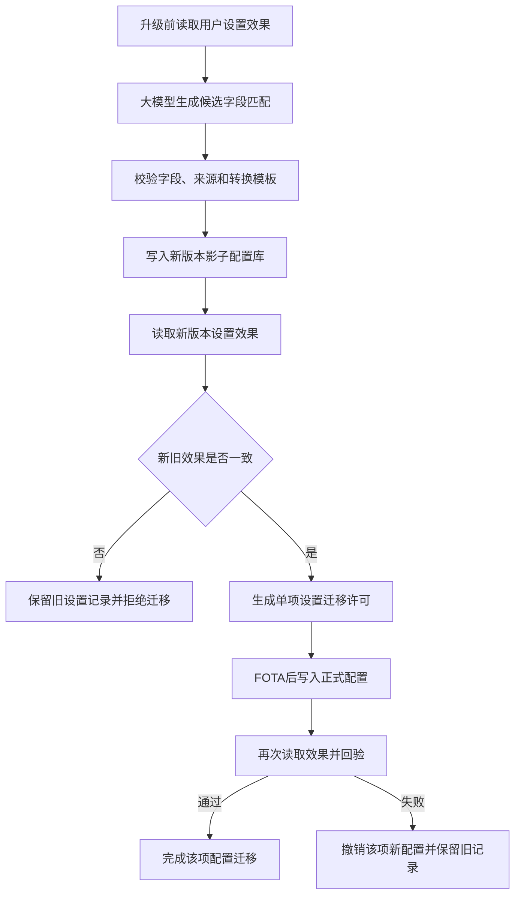

# 基于大模型设置含义匹配的座舱FOTA配置迁移方法

> 第四版初稿。本文只解决一个问题：FOTA改变配置字段后，如何避免用户的座舱设置丢失、错位或含义改变。

## 一句话创新

**大模型只负责提出旧设置与新设置的匹配关系；是否允许迁移，不比较字段名是否相同，而比较迁移前后该设置产生的座舱效果是否相同。**

本申请不把“大模型生成迁移代码”作为创新点。核心是“按设置效果验收迁移结果”。

## 1. 发明创造名称

**基于大模型设置含义匹配的座舱FOTA配置迁移方法**

## 2. 所属技术领域

本发明涉及智能座舱固件空中升级、用户配置迁移和软件版本兼容技术领域，具体涉及FOTA改变配置名称、结构或取值方式时，利用大模型生成候选设置匹配关系，并按照设置产生的可读取效果验证迁移结果的方法。

## 3. 现有技术

### 3.1 实际问题

智能座舱升级可能改变主题、语音偏好、媒体均衡器、桌面布局、通知方式和应用快捷入口等配置的字段名称、层级和取值范围。例如旧版本使用`theme=night`，新版本可能拆成`appearance.mode=dark`和`brightness.policy=auto`。简单复制旧字段会失效；按字段名匹配又可能把含义相近但效果不同的配置错误对应。

现有迁移脚本通常由开发人员逐版本编写。供应商多、版本跨度大或车辆长期未升级时，容易缺少中间版本脚本。迁移过程即使没有报错，也可能出现“数据写入成功但用户看到的效果改变”的静默问题。

### 3.2 最接近公开

1. [US20250156384A1](https://patents.google.com/patent/US20250156384A1/en)利用大模型分析旧数据库和应用代码、生成迁移代码并以模拟数据验证，接近“大模型辅助数据迁移”，但重点是数据库结构和迁移代码，不以车辆设置产生的实际效果作为放行条件。
2. [US10899363B2](https://patents.google.com/patent/US10899363B2/en)把一辆车的用户偏好转换为另一辆车的配置，涉及车辆设置转换，但不是FOTA新旧版本配置迁移，也没有大模型候选匹配和效果验收。
3. [US12254308B2](https://patents.google.com/patent/US12254308B2/en)根据车辆和用户属性动态生成车辆子系统配置，重点是按车辆属性生成配置，不处理升级前后配置含义改变。
4. [EP2418591A1](https://patents.google.com/patent/EP2418591A1/en)公开新旧软件版本间的在线数据迁移，重点是不停机复制和切换数据表，不涉及座舱用户设置效果一致性。
5. [US11249979B2](https://patents.google.com/patent/US11249979B2/en)公开在设备隔离环境中验证新配置，再保存验证后的配置，增加了“影子配置验证”的组合风险，但未针对车辆FOTA前后读取同一用户设置效果。
6. [US8073935B2](https://patents.google.com/patent/US8073935B2/en)公开配置数据的语义验证，增加了“按含义验证配置”的宽泛风险，但未公开由大模型匹配跨版本座舱设置并按旧、新效果签发单项迁移许可。

### 3.3 需要主动避开的表述

- 不主张普通数据库字段映射、名称相似度匹配或迁移代码生成；
- 不主张把用户偏好从一辆车同步到另一辆车；
- 不允许大模型直接写入正式配置库；
- 不以“迁移程序执行成功”代替设置效果验证；
- 本初稿限定于显示、媒体、语音、通知和桌面布局等非安全关键座舱设置，不涉及制动、转向、动力或驾驶辅助控制参数。

## 4. 目的

本发明旨在解决座舱FOTA后配置字段已经成功写入但实际效果丢失或改变的问题。通过记录升级前设置的可读取效果，并在新版本隔离环境中验证候选迁移后的效果，使跨版本配置迁移以用户实际获得的座舱行为为验收依据。

## 5. 技术方案及发明要点

### 5.1 唯一核心创新

迁移是否成功不由字段名、字段值或脚本返回码决定，而由“旧设置效果”和“新设置效果”是否一致决定。

例如旧版本的“夜间主题”可能由一个字段实现，新版本由两个字段共同实现。只要新版本查询得到的主题模式、亮度策略和允许显示范围符合旧版本记录的效果要求，即可迁移；字段数量和名称可以不同。

### 5.2 升级前设置效果记录

FOTA开始前，系统读取允许迁移的非安全关键配置。对于每项设置，通过预登记的只读接口取得设置效果，形成记录：

```json
{
  "setting_id": "display-theme",
  "old_fields": {"theme": "night"},
  "effect": {
    "color_mode": "dark",
    "brightness_policy": "auto",
    "day_night_switch": true
  },
  "effect_reader_id": "display-state-reader-v2"
}
```

效果读取器只能查询状态，不执行车控。每类设置的效果字段和允许误差由签名模板预先规定。

### 5.3 大模型输出

大模型读取旧字段说明、新字段说明、版本发布说明和设置效果记录，只输出候选匹配方案：

```json
{
  "setting_id": "display-theme",
  "target_fields": {
    "appearance.mode": "dark",
    "brightness.policy": "auto"
  },
  "conversion_template_id": "enum-split-v1",
  "source_refs": ["old-schema-4", "new-schema-7"]
}
```

大模型不得输出任意代码，不得访问正式配置库，只能选用白名单转换模板。无来源引用、目标字段不存在或涉及安全关键配置的方案直接拒绝。

### 5.4 设置效果验证

系统在新版本隔离环境中执行以下步骤：

1. 把候选目标字段写入影子配置库；
2. 启动对应的新版本座舱服务，但不替换正式配置；
3. 使用新版本的只读效果接口获取实际设置效果；
4. 按该设置的效果模板，与升级前设置效果逐项比较；
5. 全部必要效果相同或位于允许范围内时，生成该设置的迁移许可；
6. 未通过时保留旧配置记录，不把候选方案写入正式配置库。

这里验证的是“设置产生了什么效果”，而不是“新旧数据是否长得一样”。

### 5.5 FOTA后提交与回验

FOTA完成后，只有取得迁移许可的设置才写入正式新版本配置库。写入后再次调用同一效果读取器回验。回验通过则关闭迁移任务；回验失败则删除该项新配置并恢复到新版本默认值，同时保留旧设置记录供后续人工确认或新方案重试，不回滚整个FOTA版本。



### 5.6 最小闭环

`记录旧设置效果 -> 生成候选匹配 -> 影子写入 -> 读取新设置效果 -> 效果一致才许可 -> 正式写入 -> 再次回验`。

失败只影响当前设置项，不扩大到其他设置，也不回滚整个软件版本。

## 6. 有益效果

1. 能处理一个旧字段拆成多个新字段、多个旧字段合并或枚举名称变化；
2. 发现“数据写入成功但用户体验改变”的静默迁移错误；
3. 减少供应商和多版本跨度下人工编写迁移映射的工作量；
4. 单项设置验证失败时只撤销该项配置，不影响FOTA软件安装结果；
5. 可测量指标包括自动匹配覆盖率、效果验证通过率、错误迁移拦截率和升级后用户设置保留率；
6. 大模型不可用时可以沿用已有人工映射，不影响确定性验证和正式配置安全。

## 7. 附图及其简要说明

图1为升级前效果记录、候选匹配、影子验证、正式提交和回验流程图。

图2为模型与正式配置库之间的权限隔离图：


## 8. 权利要求初稿

1. **一种基于大模型设置含义匹配的座舱FOTA配置迁移方法**，其特征在于：在FOTA前读取旧版本非安全关键座舱设置，并通过预登记的只读效果接口取得所述设置对应的旧设置效果；根据旧版本字段说明、新版本字段说明和所述旧设置效果，由大模型生成目标字段值及转换模板标识；校验目标字段和转换模板后，将目标字段值写入新版本影子配置库；通过新版本只读效果接口取得新设置效果；在所述新设置效果满足所述旧设置效果对应的预登记比较规则时，生成单项设置迁移许可；FOTA完成后，仅将具有所述迁移许可的目标字段值写入正式配置库，并再次读取设置效果进行回验。
2. 根据权利要求1所述的方法，其特征在于，所述非安全关键座舱设置包括显示、媒体、语音、通知或桌面布局设置，不包括制动、转向、动力或驾驶辅助控制参数。
3. 根据权利要求1所述的方法，其特征在于，所述旧设置效果包括由一个或多个只读接口取得的状态字段，所述状态字段由签名效果模板限定。
4. 根据权利要求1所述的方法，其特征在于，大模型输出仅包括设置标识、目标字段值、白名单转换模板标识和来源引用，不包括可执行代码或正式配置写入指令。
5. 根据权利要求1所述的方法，其特征在于，所述比较规则包括必要状态相同、数值位于允许误差范围、枚举含义相同或组合状态满足预登记条件中的至少一种。
6. 根据权利要求1所述的方法，其特征在于，一个旧字段对应多个新字段或多个旧字段对应一个新字段时，以新设置效果满足旧设置效果作为迁移许可生成条件。
7. 根据权利要求1所述的方法，其特征在于，FOTA后回验失败时撤销当前设置项的新配置，保留其他已回验通过的设置项和FOTA软件版本。
8. **一种座舱FOTA配置迁移系统**，包括旧设置效果记录器、大模型候选匹配器、候选方案校验器、影子配置库、设置效果比较器、迁移许可签发器和正式配置写入器，各组件被配置为执行权利要求1至7任一项所述的方法。
9. **一种车辆**，包括处理器和存储器，所述处理器执行存储器中的程序时实现权利要求1至7任一项所述的方法。
10. **一种计算机可读存储介质**，其上存储有程序，所述程序被处理器执行时实现权利要求1至7任一项所述的方法。

## 初步判断

本选题比普通“大模型生成迁移代码”更窄，但车辆技术效果更明确。主要创造性风险来自“大模型数据库迁移 + 车辆配置转换 + 影子配置验证”的多文献组合，风险高于第一篇，建议作为第四版第二申请方向。主权项必须保留“升级前读取设置效果、影子迁移后读取新效果、按效果一致性签发单项许可、正式写入后再次回验”这一完整链条。若只保留字段匹配或影子迁移，创造性会明显下降。
