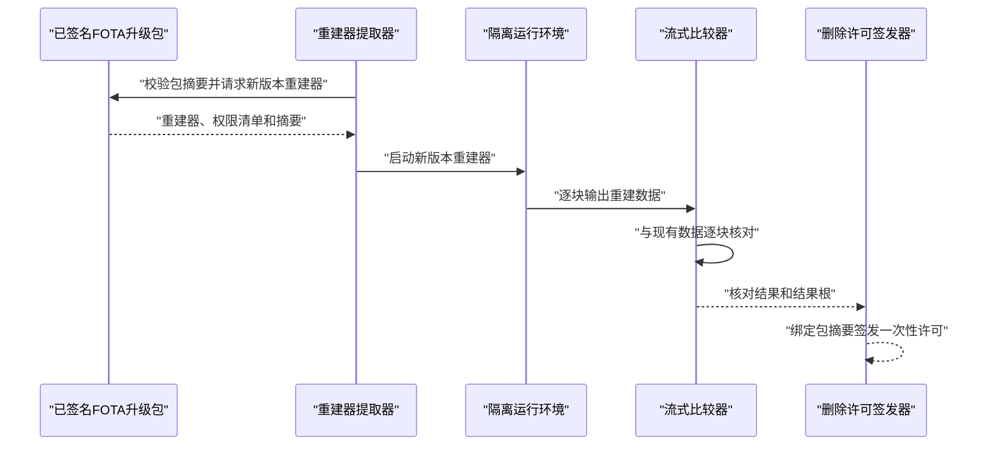
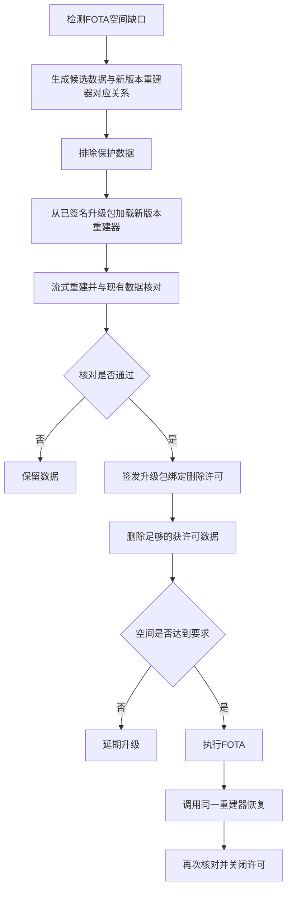
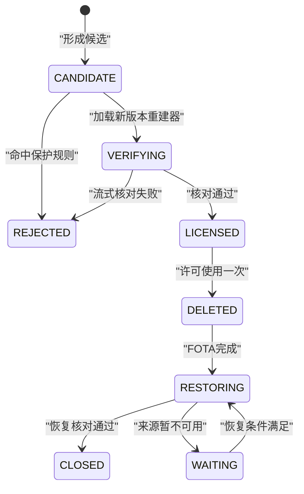
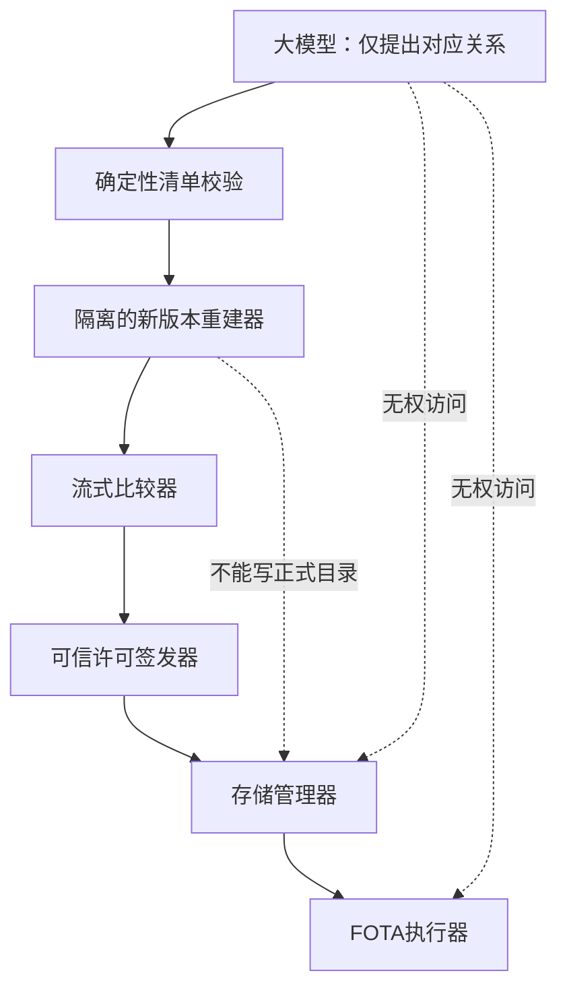

# 专利一第四版详细技术交底书

> 发明名称：基于新版本重建验证的座舱FOTA腾空间方法  
> 核心创新：删除数据前，用本次升级包中的新版本重建器流式重建并核对；删除许可只对本次升级包有效。

## 摘要

本发明公开一种基于新版本重建验证的座舱FOTA腾空间方法。车辆剩余空间不足时，大模型根据座舱数据说明、来源说明及升级包清单生成候选可恢复数据，但不具有删除权限。系统从已签名升级包中提取与候选数据对应的新版本重建器，在旧版本隔离环境中读取原始来源，以数据块流的方式生成重建结果，并在不保存完整副本的情况下与现有数据逐块比较。比较通过后，生成绑定车辆、数据对象、来源版本、重建器摘要和升级包摘要的一次性删除许可。存储管理器仅删除持有所述许可的数据，释放空间后执行FOTA；升级完成后调用同一新版本重建器恢复数据并重新核对。若流式验证、空间释放、升级或恢复任一步失败，则停止扩大删除范围。该方法解决普通缓存清理无法证明新版本仍能恢复旧缓存的问题，并减少为FOTA长期预留存储空间的需求。

## 1. 发明创造名称

**基于新版本重建验证的座舱FOTA腾空间方法**

## 2. 所属技术领域

本发明涉及智能座舱固件空中升级、车载存储管理、软件包验证和可恢复数据重建领域，具体涉及利用本次FOTA升级包内的新版本重建器，在删除座舱派生数据前进行流式重建核对的方法。

## 3. 现有技术

### 3.1 技术问题

FOTA通常需要同时保存升级包、解压内容、新版本镜像和回退数据。座舱长期运行形成大量地图切片、媒体缩略图、搜索索引、语音临时资源和应用缓存，可能造成升级空间不足。

固定清理目录不能适应不同供应商和版本；按照访问时间删除只能说明数据较少使用，不能说明数据能够恢复。更重要的是，旧版本能生成某项缓存，不代表升级后的新版本仍能从同一来源生成兼容数据。例如新版本可能删除旧接口、改变媒体编码器或变更地图索引格式。

### 3.2 最接近现有技术

1. [CN117472414A](https://patents.google.com/patent/CN117472414A/zh)在OTA空间不足时使用业务数据备用分区，未通过新版本重建器验证可删除数据。
2. [US20170090901A1](https://patents.google.com/patent/US20170090901A1/en)采用分段复制、补丁和归档减少更新空间，处理对象是待更新文件本身。
3. [WO2024039768A1](https://patents.google.com/patent/WO2024039768A1/en)生成临时内容并比较指纹，以确认缓存中的重复内容可以删除，是本申请“删除前生成并比较”的高风险文献。但该文献不涉及车辆FOTA，不使用本次升级包内的新版本重建器，也不把删除许可绑定升级包。
4. [US11695978B2](https://patents.google.com/patent/US11695978B2/en)删除低需求视频转码缓存并在需要时重新转码，未在删除前验证本次软件更新后的重建器。
5. [CN121143846A](https://patents.google.com/patent/CN121143846A/zh)使用大模型产生OTA故障修复方案，但未公开升级包绑定的重建验证和删除许可。

### 3.3 本申请与普通方案的界限

- 不是按目录、热度或模型评分直接删除；
- 不是把升级包放入备用分区；
- 不是使用旧版本工具证明旧版本能够恢复；
- 不是生成完整临时副本后再删除；
- 必须使用本次升级包中的新版本重建器；
- 必须把删除许可绑定本次升级包摘要，升级包变化后许可失效。

## 4. 目的

本发明旨在解决两个相互关联的技术问题：一是FOTA空间不足时如何安全释放派生数据占用的空间；二是如何证明升级后的新版本仍能恢复这些数据。通过流式运行升级包内的新版本重建器，在删除前验证“本次升级完成后可恢复”，并以升级包绑定许可控制删除。

## 5. 技术方案及发明要点

### 5.1 系统组成

系统包括空间检测器、候选生成器、保护清单校验器、升级包重建器提取器、隔离运行器、流式比较器、删除许可签发器、存储管理器、FOTA执行器和升级后恢复器。


### 5.2 数据分类

允许进入候选清单的数据必须是从其他受保护来源生成的派生数据，例如：

- 由用户原始媒体生成的缩略图；
- 由已下载地图基础包生成的搜索索引；
- 由应用资源包生成的图形缓存；
- 可由已确认云端对象重新下载的离线副本。

账户、密钥、支付记录、收藏、用户原始媒体、用户创作内容、不可再次下载的授权内容和法规要求保留的数据均为保护数据。

### 5.3 大模型的单一作用

大模型只把目录说明、服务说明、文件归属和升级包中的重建器说明整理为候选对应关系：

```json
{
  "data_group": "media-thumbnail-cache",
  "source_group": "user-media-original",
  "new_rebuilder": "thumbnail-builder-v5",
  "comparison_rule": "image-index-v2",
  "evidence": ["manifest:42", "service-doc:18"]
}
```

确定性校验器检查数据组和来源组是否在登记表中、新版本重建器是否确实位于已签名升级包、比较规则是否在白名单。模型不能输出删除命令、脚本或任意文件路径。

### 5.4 使用新版本重建器

升级包发布方在清单中为可重建数据提供：

- 新版本重建器标识和二进制摘要；
- 允许读取的来源类型；
- 输出数据类型和版本；
- 最大内存、CPU、网络和执行时限；
- 对应流式比较规则；
- 升级后调用入口。

车辆验证升级包签名后，将重建器放入隔离运行环境。重建器只能读取登记来源和写入比较管道，不能访问正式数据目录、车控接口和网络；确需云端来源时，只能访问清单中的内容地址。

### 5.5 流式重建核对

为了避免在空间不足时再保存一份完整副本，重建器按固定大小输出数据块。流式比较器同时读取现有派生数据，对两个数据流进行核对。

完全一致类数据比较每个数据块的哈希、顺序和总长度。允许编码差异类数据先由登记的规范化器转换为统一表示，再比较对象数量、索引键、引用关系和读取结果。

```text
VERIFY_STREAM(source, old_data, new_rebuilder, rule):
  start new_rebuilder(source)
  while old_data或重建输出尚未结束:
    old_block <- read_normalized_block(old_data, rule)
    new_block <- read_normalized_block(new_rebuilder, rule)
    if hash(old_block) != hash(new_block):
      return FAIL
    update rolling_root(old_block)
  if 长度、对象数量或索引关系不一致:
    return FAIL
  return PASS, rolling_root
```

流式缓冲区大小小于待释放数据的设定比例，例如不超过1%，从而不要求额外保存完整重建结果。



### 5.6 一次性删除许可

验证通过后签发：

```json
{
  "vehicle_id_hash": "V...",
  "data_group": "media-thumbnail-cache",
  "source_snapshot": "SRC-203",
  "rebuilder_digest": "RB...",
  "package_digest": "PKG...",
  "comparison_root": "ROOT...",
  "max_delete_bytes": 840000000,
  "expires_at": "2026-08-02T03:00:00Z",
  "used": false
}
```

许可只能使用一次。升级包、重建器、来源版本、比较规则或数据对象变化时，许可失效。存储管理器按照空间缺口从已获许可对象中选择足够的对象，不扩大到未验证对象。

### 5.7 主流程



### 5.8 状态机



### 5.9 异常处理

| 异常 | 处理 |
|---|---|
| 大模型不可用 | 使用人工登记对应关系；没有候选则延期 |
| 升级包签名失败 | 不加载重建器，不删除 |
| 重建器越权 | 终止隔离进程并废止候选 |
| 流式输出超时或中断 | 核对失败，保留原数据 |
| 释放空间仍不足 | 延期FOTA |
| 升级包在删除后变化 | 禁止安装变化后的包，重新验证 |
| FOTA失败并回到旧版本 | 旧版本可使用原来源重建；删除许可保持待恢复 |
| 升级后来源暂不可用 | 不删除更多数据，等待来源恢复 |

### 5.10 三个实施例

#### 实施例一：媒体缩略图

FOTA需要额外800 MB。大模型识别缩略图目录对应用户原始媒体和升级包内`thumbnail-builder-v5`。系统用新重建器读取原始媒体，流式生成规范化缩略图索引并与现有索引核对。通过后删除840 MB缩略图。升级后同一重建器重新生成，媒体列表数量、媒体标识和缩略图读取均通过。

#### 实施例二：地图搜索索引被拒绝

候选地图索引占1.2 GB，但新版本重建器生成的道路条目比现有索引少。流式核对失败，系统保留该索引，不因空间不足降低规则，FOTA延期。

#### 实施例三：升级包被替换

删除许可绑定升级包摘要`PKG-A`。云端下发修订包`PKG-B`时，FOTA执行器发现摘要不同，禁止使用原许可安装新包。车辆重新提取`PKG-B`中的重建器并完成验证后才能删除数据。

### 5.11 权限边界



## 6. 有益效果

1. 验证的是本次升级后的重建能力，而不是旧版本历史能力；
2. 流式核对无需保存完整临时副本，适用于已经空间不足的车辆；
3. 删除许可绑定升级包，可阻止“验证A包、安装B包”；
4. 保护数据由确定性清单排除，大模型误判不会直接导致删除；
5. 可量化释放空间、额外缓冲占用、验证耗时、错误删除拦截率和升级后恢复成功率。

## 7. 附图及其简要说明

1. 图1：FOTA腾空间系统架构图。
2. 图2：删除前流式验证与FOTA恢复流程图。
3. 图3：候选数据状态机图。
4. 图4：模型、重建器、许可和执行权限边界图。
5. 图5：新版本重建器流式核对时序图。

## 8. 权利要求

1. **一种基于新版本重建验证的座舱FOTA腾空间方法**，其特征在于，包括：在车辆可用存储空间小于FOTA所需空间时，根据座舱数据说明、数据来源说明和FOTA升级包清单生成候选可恢复数据与新版本重建器的对应关系；从已签名的所述FOTA升级包中取得所述新版本重建器；在不删除候选可恢复数据的情况下，使所述新版本重建器在隔离环境中读取所述候选可恢复数据对应的来源数据并输出重建数据流；将所述重建数据流与候选可恢复数据按照预登记比较规则逐块核对；核对通过后生成绑定候选可恢复数据、来源数据版本、新版本重建器摘要和FOTA升级包摘要的一次性删除许可；仅删除具有有效一次性删除许可的数据以释放FOTA所需空间；执行所述FOTA升级包；升级完成后调用所述新版本重建器恢复被删除数据，并按照所述预登记比较规则核对恢复结果。
2. 根据权利要求1所述的方法，其特征在于，候选对应关系由大模型生成，大模型输出限于数据组标识、来源组标识、新版本重建器标识、比较规则标识和依据引用。
3. 根据权利要求1所述的方法，其特征在于，用户原始媒体、账户凭据、密钥、支付记录、收藏数据、不可再次取得的授权内容和法规要求保留的数据被确定为不得删除数据。
4. 根据权利要求1所述的方法，其特征在于，所述FOTA升级包清单记录新版本重建器的二进制摘要、允许读取的来源类型、输出类型、资源上限、比较规则和升级后调用入口。
5. 根据权利要求1所述的方法，其特征在于，所述隔离环境限制新版本重建器只能读取登记来源，并只能向流式比较器输出数据。
6. 根据权利要求1所述的方法，其特征在于，所述逐块核对包括对固定大小数据块进行规范化、哈希比较、顺序比较和总长度比较。
7. 根据权利要求6所述的方法，其特征在于，对于允许编码差异的数据，还比较对象数量、索引键、引用关系或白名单服务读取结果。
8. 根据权利要求1所述的方法，其特征在于，流式核对使用的缓冲空间小于候选可恢复数据大小的预设比例。
9. 根据权利要求1所述的方法，其特征在于，一次性删除许可还包括车辆标识摘要、比较结果根、最大删除字节数、有效期和已使用标志。
10. 根据权利要求1所述的方法，其特征在于，FOTA升级包摘要、新版本重建器摘要、来源数据版本或比较规则发生变化时，所述一次性删除许可失效。
11. 根据权利要求1所述的方法，其特征在于，从多个已取得一次性删除许可的数据中选择总大小不小于空间缺口的数据进行删除，且不删除未取得许可的数据。
12. 根据权利要求11所述的方法，其特征在于，全部已许可数据的总大小仍小于空间缺口时，停止本次FOTA。
13. 根据权利要求1所述的方法，其特征在于，升级后恢复失败时保留来源数据引用和删除许可记录，并在来源重新可用时再次恢复。
14. 根据权利要求1所述的方法，其特征在于，FOTA失败并恢复旧软件版本时，调用旧版本登记重建器或所述新版本重建器恢复被删除数据。
15. **一种基于新版本重建验证的座舱FOTA腾空间系统**，包括空间检测器、候选生成器、保护清单校验器、升级包重建器提取器、隔离运行器、流式比较器、删除许可签发器、存储管理器、FOTA执行器和升级后恢复器，各组件被配置为执行权利要求1至14任一项所述的方法。
16. 根据权利要求15所述的系统，其特征在于，候选生成器与删除许可签发器、存储管理器和FOTA执行器权限隔离。
17. **一种车辆**，包括座舱域控制器、存储器和处理器，其特征在于，处理器执行存储器中的指令时实现权利要求1至14任一项所述的方法。
18. **一种非暂态计算机可读存储介质**，其上存储有程序，所述程序被处理器执行时实现权利要求1至14任一项所述的方法。
19. **一种计算机程序产品**，包括计算机程序，所述程序运行时实现权利要求1至14任一项所述的方法。
20. **一种FOTA数据删除许可装置**，包括流式比较接口和许可签发接口，所述流式比较接口接收升级包内新版本重建器输出的数据流并与待删除数据核对，所述许可签发接口在核对通过后输出绑定所述升级包摘要的一次性删除许可。
