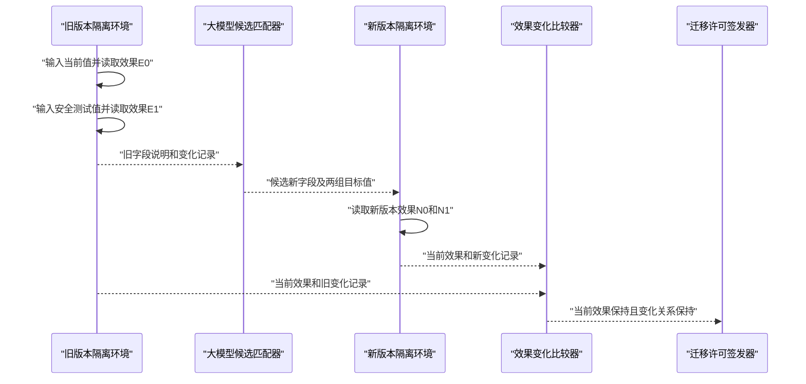
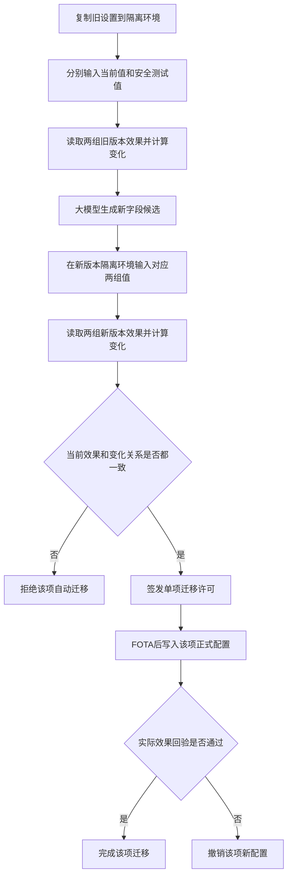
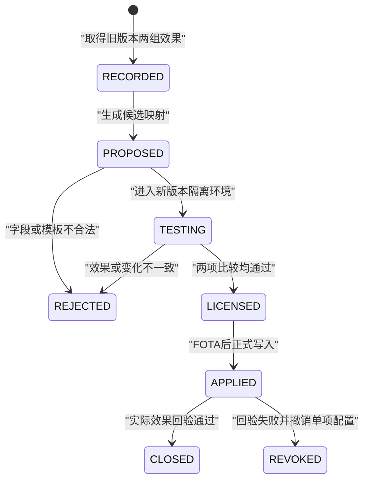
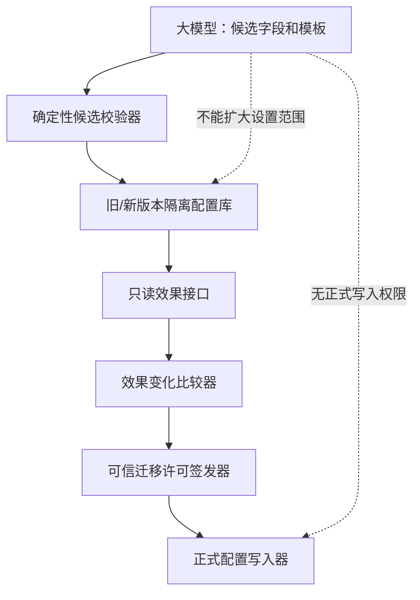

# 专利二第四版详细技术交底书

> 发明名称：基于设置变化验证的座舱FOTA配置迁移方法  
> 核心创新：分别输入当前值和安全测试值，比较新旧版本产生的设置效果变化；变化一致才允许迁移。

## 摘要

本发明公开一种基于设置变化验证的座舱FOTA配置迁移方法。FOTA前，在旧版本隔离环境中对非安全关键座舱设置分别输入用户当前值和预登记安全测试值，通过只读效果接口取得两组旧版本效果，并生成旧版本设置变化记录。大模型根据新旧字段说明提出目标字段及白名单转换模板，但不能写正式配置。系统在新版本隔离环境中分别写入转换后的当前值和测试值，取得两组新版本效果并生成新版本设置变化记录。只有当前值效果满足保持要求，且测试值引起的效果变化与旧版本设置变化满足预登记比较规则时，才签发单项设置迁移许可。FOTA后仅提交获许可设置并再次读取实际效果；回验失败时仅撤销该设置。该方法能够排除新版本因默认值相同而产生的假通过，并验证候选字段确实控制与旧字段相同的座舱功能。

## 1. 发明创造名称

**基于设置变化验证的座舱FOTA配置迁移方法**

## 2. 所属技术领域

本发明涉及智能座舱固件空中升级、用户配置迁移和软件版本兼容领域，具体涉及通过比较设置值变化在新旧版本中引起的可读取效果变化，验证大模型生成的配置对应关系。

## 3. 现有技术

### 3.1 技术问题

FOTA可能改变主题、媒体均衡器、语音偏好、通知方式和桌面布局的字段名称、层级或取值。人工迁移脚本难以覆盖不同供应商和跨多个版本的车辆。大模型能够理解字段说明，但名称相似不表示含义相同。

仅比较迁移后的当前效果也不可靠。例如用户当前设置和新版本默认值都是“深色”，即使大模型把旧主题字段映射到一个无关字段，新版本仍可能返回深色并通过检查。系统需要证明候选新字段确实会像旧字段一样改变目标效果。

### 3.2 最接近现有技术

1. [US20250156384A1](https://patents.google.com/patent/US20250156384A1/en)利用大模型分析旧数据库、生成迁移代码并用模拟数据验证，是“大模型迁移”的高相关文献，但未比较同一设置两种取值在新旧版本中的效果变化。
2. [US6728877B2](https://patents.google.com/patent/US6728877B2/en)自动转换旧计算机设置，使目标系统获得相同结果，是“设置迁移保持结果”的高风险文献，但未通过测试值证明目标字段与旧字段控制同一效果。
3. [US11249979B2](https://patents.google.com/patent/US11249979B2/en)在设备隔离环境中验证新配置，未形成FOTA前后的双取值效果变化记录。
4. [US8073935B2](https://patents.google.com/patent/US8073935B2/en)公开配置数据语义验证，未公开大模型候选匹配及设置变化一致性许可。
5. [US7483757B2](https://patents.google.com/patent/US7483757B2/en)把旧控制块映射为一个或多个新控制块，未涉及智能座舱用户设置和FOTA单项迁移回验。
6. [US10899363B2](https://patents.google.com/patent/US10899363B2/en)在不同车辆间转换偏好设置，未处理同一车辆FOTA前后设置字段变化。

### 3.3 本申请与普通方案的界限

- 不是字段名或向量相似度达到阈值就迁移；
- 不是迁移脚本执行成功就放行；
- 不是只比较用户当前值对应的单个结果；
- 必须增加一个安全测试值，验证该设置引起的效果变化；
- 必须同时满足“当前效果保持”和“变化关系保持”；
- 每项设置单独许可，失败不回滚整个FOTA。

## 4. 目的

本发明旨在验证大模型提出的新旧配置字段是否真正控制同一座舱效果，避免因默认值相同、无关字段写入成功或字段含义变化导致错误迁移，并在单项设置范围内完成验证、提交和撤销闭环。

## 5. 技术方案及发明要点

### 5.1 系统架构

系统包括设置登记表、旧版本隔离环境、安全测试值选择器、只读效果接口、大模型候选匹配器、候选校验器、新版本隔离环境、效果变化比较器、迁移许可签发器、正式配置写入器和回验器。


### 5.2 适用设置范围

本方法适用于不直接控制车辆安全动作的设置，例如：

- 显示主题、字号、壁纸和桌面布局；
- 音源偏好、媒体均衡器和播放界面；
- 语音唤醒偏好、回答风格和非车控快捷词；
- 应用通知、消息展示和隐私提示方式。

制动、转向、动力、驾驶辅助、车身安全、支付和账户认证参数不进入本方法。

### 5.3 旧版本设置变化记录

对设置`S`，读取用户当前值`v0`。安全测试值选择器从该设置的签名模板取得`v1`。`v1`仅写入旧版本隔离配置，不改变用户真实设置。

分别运行：

```text
E0 = READ_EFFECT(old_version, S=v0)
E1 = READ_EFFECT(old_version, S=v1)
D_old = DIFFERENCE(E0, E1)
```

其中`E0`和`E1`是由只读接口返回的规范化效果，`D_old`表示从当前值改为测试值后哪些效果字段变化、变化方向和允许范围。

示例：

```json
{
  "setting": "theme",
  "current_value": "night",
  "test_value": "day",
  "current_effect": {"palette":"dark","auto_switch":false},
  "test_effect": {"palette":"light","auto_switch":false},
  "change": {"palette":"dark_to_light"}
}
```

### 5.4 安全测试值

安全测试值必须满足：

- 来自预登记枚举或允许范围；
- 仅在隔离环境中使用；
- 能使至少一个目标效果字段发生可观察变化；
- 不触发购买、账户、消息发送或车控；
- 测试结束后销毁隔离配置。

若找不到能产生可观察变化的安全测试值，该设置不自动迁移。

### 5.5 大模型候选输出

大模型读取旧字段说明、新字段说明、版本发布说明和旧版本设置变化记录，输出：

```json
{
  "setting": "theme",
  "target_fields": ["appearance.mode"],
  "current_target_value": "dark",
  "test_target_value": "light",
  "template": "enum-map-v3",
  "evidence": ["old-schema:12", "new-schema:31"]
}
```

模型只能选择已登记目标字段和转换模板，不能输出代码、正式写入命令或测试值范围之外的数据。

### 5.6 新版本变化验证

候选校验通过后，在新版本隔离环境分别写入当前目标值和测试目标值：

```text
N0 = READ_EFFECT(new_version, target=current_target_value)
N1 = READ_EFFECT(new_version, target=test_target_value)
D_new = DIFFERENCE(N0, N1)

PASS if MATCH(E0, N0) and MATCH_CHANGE(D_old, D_new)
```

`MATCH(E0,N0)`保证用户当前效果得到保留；`MATCH_CHANGE(D_old,D_new)`保证新字段对效果的控制关系与旧字段一致。两者缺一不可。

变化比较规则由设置模板定义，可包括：

- 变化字段集合相同；
- 枚举变化方向相同；
- 数值变化方向相同且比例位于范围；
- 多字段组合满足同一逻辑条件；
- 不得出现模板之外的新副作用字段。



### 5.7 单项迁移许可

许可包含车辆摘要、设置标识、旧字段摘要、新字段摘要、当前值和测试值摘要、旧变化记录根、新变化记录根、转换模板、升级包摘要和有效期。

升级包或字段说明改变时许可失效。每项设置单独签发，不能用一个设置的许可写入另一个设置。

### 5.8 主流程



### 5.9 状态机



### 5.10 异常处理

| 异常 | 处理 |
|---|---|
| 大模型不可用 | 使用人工映射；没有映射则保留旧记录 |
| 无安全测试值 | 不自动迁移该设置 |
| 测试值未引起效果变化 | 无法证明控制关系，拒绝 |
| 新版本出现额外效果字段 | 拒绝并记录差异 |
| 只读效果接口超时 | 拒绝，不以缓存结果代替 |
| 升级包变化 | 废止许可并重新验证 |
| FOTA后回验失败 | 只撤销当前设置，使用新版本默认值 |
| 多个设置相互影响 | 将其登记为一个组合设置，联合验证 |

### 5.11 三个实施例

#### 实施例一：主题字段拆分

旧字段`theme=night/day`，新版本拆为`appearance.mode`和`brightness.policy`。当前值和测试值分别产生深色、浅色效果。候选映射在新版本中产生同样的色板变化，且没有新增通知或隐私效果，获得许可。

#### 实施例二：无关字段导致假通过

用户当前是深色主题，新版本默认也是深色。大模型错误地把旧主题映射到`wallpaper.tint`。当前效果比较看似通过，但把测试值改为浅色时色板没有变化，变化比较失败，阻止错误迁移。

#### 实施例三：均衡器数值范围变化

旧版本低音范围为0至10，新版本为-5至5。旧版本从当前值6改为测试值8时，低频增益增加2个等级；映射模板把两值转换为1和3，新版本低频增益同方向增加且幅度位于允许范围，获得许可。FOTA后实际回验失败时仅恢复新版本默认均衡器，不影响主题和语音设置。

### 5.12 权限边界



## 6. 有益效果

1. 证明候选新字段确实控制与旧字段相同的效果，而非碰巧等于默认值；
2. 支持一个旧字段拆成多个新字段、多个旧字段合并和数值范围变化；
3. 设置逐项许可和撤销，不因单项失败回滚整个FOTA；
4. 模型只解决跨供应商字段说明难以统一的问题，确定性组件负责放行；
5. 可量化错误映射拦截率、自动迁移覆盖率、设置保留率和单项撤销率。

## 7. 附图及其简要说明

1. 图1：配置迁移系统架构图。
2. 图2：双取值效果变化验证流程图。
3. 图3：单项设置迁移状态机图。
4. 图4：模型、隔离配置和正式配置权限边界图。
5. 图5：旧、新版本双取值效果变化验证时序图。

## 8. 权利要求

1. **一种基于设置变化验证的座舱FOTA配置迁移方法**，其特征在于，包括：在FOTA前，将非安全关键座舱设置复制至旧版本隔离环境；在所述旧版本隔离环境中分别输入所述座舱设置的用户当前值和预登记安全测试值，通过只读效果接口取得对应的第一旧版本效果和第二旧版本效果，并根据二者差异生成旧版本设置变化记录；根据旧版本字段说明、新版本字段说明和旧版本设置变化记录，由大模型生成新版本目标字段、当前目标值、测试目标值和白名单转换模板的候选对应关系；校验所述候选对应关系后，在新版本隔离环境中分别输入当前目标值和测试目标值，通过只读效果接口取得第一新版本效果和第二新版本效果，并生成新版本设置变化记录；在第一新版本效果满足第一旧版本效果的保持规则，且新版本设置变化记录满足旧版本设置变化记录的变化比较规则时，签发绑定所述座舱设置和FOTA升级包的单项迁移许可；FOTA完成后，仅将具有有效单项迁移许可的当前目标值写入正式配置，并读取实际效果进行回验。
2. 根据权利要求1所述的方法，其特征在于，所述非安全关键座舱设置包括显示、媒体、语音、通知或桌面布局设置，不包括制动、转向、动力、驾驶辅助、支付或账户认证参数。
3. 根据权利要求1所述的方法，其特征在于，所述安全测试值来自设置模板限定的枚举或数值范围，仅写入隔离配置。
4. 根据权利要求3所述的方法，其特征在于，安全测试值使至少一个目标效果字段相对于用户当前值发生可观察变化。
5. 根据权利要求1所述的方法，其特征在于，旧版本设置变化记录包括发生变化的效果字段、变化方向、变化幅度和未发生变化的约束字段。
6. 根据权利要求1所述的方法，其特征在于，大模型输出限于设置标识、目标字段、当前目标值、测试目标值、白名单转换模板和依据引用。
7. 根据权利要求1所述的方法，其特征在于，候选对应关系涉及未登记字段、非白名单模板或安全关键设置时被拒绝。
8. 根据权利要求1所述的方法，其特征在于，所述保持规则包括必要效果字段相同、枚举含义相同或数值位于允许误差范围。
9. 根据权利要求1所述的方法，其特征在于，所述变化比较规则包括变化字段集合相同、枚举变化方向相同、数值变化方向相同或组合状态满足相同逻辑条件中的至少一种。
10. 根据权利要求9所述的方法，其特征在于，新版本出现设置模板未允许的附加效果变化时，不签发单项迁移许可。
11. 根据权利要求1所述的方法，其特征在于，一个旧字段对应多个新字段或多个旧字段对应一个新字段时，对所述多个字段的组合效果进行变化比较。
12. 根据权利要求1所述的方法，其特征在于，单项迁移许可记录旧字段摘要、新字段摘要、当前值和测试值摘要、旧版本设置变化记录根、新版本设置变化记录根、转换模板、升级包摘要和有效期。
13. 根据权利要求12所述的方法，其特征在于，升级包摘要、字段说明或转换模板发生变化时，单项迁移许可失效。
14. 根据权利要求1所述的方法，其特征在于，FOTA后的实际效果回验失败时撤销当前设置项的新配置，并保留其他回验通过的设置项和FOTA软件版本。
15. **一种基于设置变化验证的座舱FOTA配置迁移系统**，包括设置登记表、旧版本隔离环境、安全测试值选择器、只读效果接口、大模型候选匹配器、候选校验器、新版本隔离环境、效果变化比较器、迁移许可签发器、正式配置写入器和回验器，各组件被配置为执行权利要求1至14任一项所述的方法。
16. 根据权利要求15所述的系统，其特征在于，大模型候选匹配器与正式配置写入器权限隔离。
17. **一种车辆**，包括座舱域控制器、存储器和处理器，其特征在于，处理器执行存储器中的指令时实现权利要求1至14任一项所述的方法。
18. **一种非暂态计算机可读存储介质**，其上存储有程序，所述程序被处理器执行时实现权利要求1至14任一项所述的方法。
19. **一种计算机程序产品**，包括计算机程序，所述程序运行时实现权利要求1至14任一项所述的方法。
20. **一种座舱设置迁移许可装置**，包括旧版本设置变化输入接口、新版本设置变化输入接口、变化比较器和许可输出接口，所述许可输出接口仅在当前效果保持且新旧版本设置变化满足比较规则时输出单项迁移许可。
